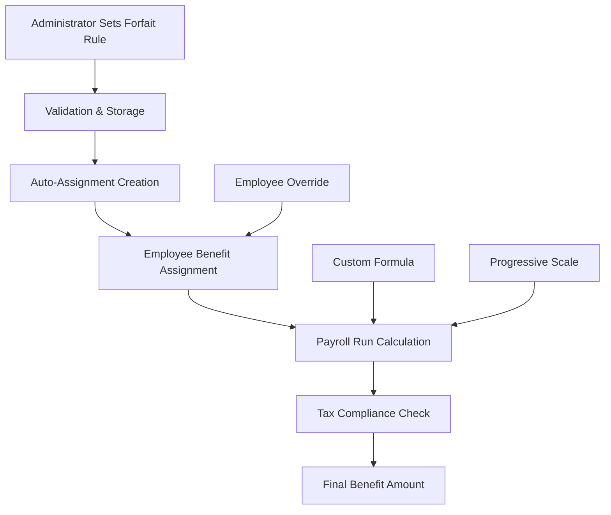

# Forfait System Documentation

**Part of:** [RecruitIQ Technical Documentation](./README.md)  
**Version:** 1.0  
**Last Updated:** December 8, 2025

---

## Table of Contents

1. [System Overview](#system-overview)
2. [Architecture](#architecture)
3. [Core Components](#core-components)
4. [Data Flow](#data-flow)
5. [Dutch Tax Compliance](#dutch-tax-compliance)
6. [API Reference](#api-reference)
7. [Configuration Guide](#configuration-guide)
8. [Troubleshooting](#troubleshooting)

---

## System Overview

The Forfait System in RecruitIQ implements **Dutch tax compliance** for Surinamese payroll management according to **Article 11 of the Wet Loonbelasting** (Dutch Wage Tax Act). It provides automated calculation and management of taxable benefits including company cars, housing benefits, meal allowances, and medical coverage.

### Key Features

- ✅ **Dutch Tax Law Compliance** - Implements Article 11 Wet Loonbelasting
- ✅ **Three-Tier Architecture** - Global, Organization, and Employee levels
- ✅ **Automatic Assignment** - Auto-creates benefit assignments from rules
- ✅ **Payroll Integration** - Seamless integration with payroll calculations
- ✅ **Formula Engine** - Support for complex custom calculations
- ✅ **Multi-Tenant Security** - Complete tenant isolation
- ✅ **Audit Trail** - Full logging and compliance tracking

### Supported Benefit Types

| Benefit Type | Dutch Tax Rate | Calculation Method |
|-------------|---------------|-------------------|
| **Company Car** | 2% or 3% | Percentage of catalog value |
| **Housing Benefit** | 7.5% | Percentage of rental value |
| **Meal Benefits** | Fixed rates | Hot meal forfait amounts |
| **Medical Coverage** | Progressive | Tiered based on coverage value |
| **Transport Allowance** | Variable | Distance-based calculations |
| **Communication** | Fixed | Monthly phone/internet allowance |

---

## Architecture

### System Architecture Overview

```
┌─────────────────────────────────────────────────────────────┐
│                    Frontend Layer                            │
│  PayLinQ App → API Client → Controllers                     │
└─────────────────────┬───────────────────────────────────────┘
                      │
┌─────────────────────▼───────────────────────────────────────┐
│                  Business Logic Layer                       │
│  ┌─────────────────────┐  ┌─────────────────────────────────┐ │
│  │ ForfaitRuleService  │  │ ForfaitairBenefitsService      │ │
│  │ (Rule Management)   │  │ (Benefit Assignment)           │ │
│  └─────────────────────┘  └─────────────────────────────────┘ │
└─────────────────────┬───────────────────────────────────────┘
                      │
┌─────────────────────▼───────────────────────────────────────┐
│                   Data Access Layer                         │
│  PayComponentRepository → PostgreSQL Database               │
└─────────────────────────────────────────────────────────────┘
```

### Three-Tier Benefit Management

```
Tier 1: Global Component Library (DEPRECATED)
├── Standard forfait templates
├── Dutch tax compliance rules
└── System-wide benefit definitions

Tier 2: Organization Custom Components
├── Tenant-specific benefit rules
├── Custom calculation formulas
└── Organization overrides

Tier 3: Employee-Level Assignments
├── Individual benefit assignments
├── Employee-specific overrides
└── Personal calculation adjustments
```

---

## Core Components

### 1. ForfaitRuleService.js (897 lines)

**Primary Responsibility:** Core forfait rule management and Dutch tax compliance

#### Key Methods

```javascript
// Rule Configuration
setForfaitRule(ruleData, organizationId, userId)
getForfaitRule(ruleCode, organizationId)
removeForfaitRule(ruleCode, organizationId, userId)

// Auto-Assignment System
autoCreateForfaitAssignment(rule, organizationId, userId)
mapValues(inputData, mappingConfig)
validateMappedValues(values, validationRules)

// Payroll Integration
calculateForfaitForPayroll(payrollRunId, organizationId)
_calculateForfaitForEmployee(employeeId, rule, variables)

// Template Management
getForfaitRuleTemplates(organizationId)
previewForfaitCalculation(ruleData, variables, organizationId)
```

#### Calculation Types

1. **`percentage_of_catalog_value`**
   - Used for company car benefits
   - Calculates 2% or 3% of vehicle catalog value
   - Complies with Dutch tax law Article 11

2. **`progressive_scale`**
   - Tiered percentage calculations
   - Multiple rate brackets
   - Used for medical and housing benefits

3. **`fixed_monthly`**
   - Fixed monthly amounts
   - Used for meal and communication benefits
   - Simple flat-rate calculations

4. **`formula_based`**
   - Custom formulas using FormulaEngineService
   - Complex calculations with variables
   - Flexible for unique benefit structures

### 2. ForfaitairBenefitsService.js (605 lines)

**Primary Responsibility:** Three-tier benefit management and employee assignments

#### Key Methods

```javascript
// Tenant Benefit Library (Tier 2)
getTenantBenefitLibrary(organizationId, filters)
createCustomBenefit(componentData, organizationId, userId)
cloneAndCustomizeGlobalBenefit(globalCode, overrides, organizationId, userId)

// Employee Assignment (Tier 3)
assignBenefitToEmployee(assignmentData, organizationId, userId)
getEmployeeBenefits(employeeId, organizationId, effectiveDate)
calculateEmployeeBenefit(employeeId, componentCode, variables, organizationId)
removeBenefitFromEmployee(assignmentId, organizationId, userId)

// Statistics & Reporting
getBenefitStatistics(organizationId)
```

#### Validation Schemas

```javascript
// Benefit Assignment Schema
static assignBenefitSchema = Joi.object({
  employeeId: Joi.string().uuid().required(),
  componentCode: Joi.string().required(),
  effectiveFrom: Joi.date().required(),
  effectiveTo: Joi.date().optional(),
  configuration: Joi.object().optional(),
  overrideAmount: Joi.number().optional(),
  overrideFormula: Joi.string().optional(),
  notes: Joi.string().optional()
});

// Custom Benefit Creation Schema  
static createCustomBenefitSchema = Joi.object({
  componentCode: Joi.string().required(),
  componentName: Joi.string().required(),
  category: Joi.string().valid('benefit').required(),
  calculationType: Joi.string().valid('fixed', 'percentage', 'formula').required(),
  formula: Joi.string().optional(),
  isTaxable: Joi.boolean().default(true),
  isRecurring: Joi.boolean().default(true)
});
```

### 3. TypeScript Definitions

```typescript
// Core benefit configuration interface
interface ForfaitairBenefitConfig {
  benefitType: 'car' | 'housing' | 'phone';
  isActive: boolean;
  details: {
    // Car-specific fields
    catalogValue?: number;
    fuelType?: 'gasoline' | 'diesel' | 'electric' | 'hybrid';
    co2Emission?: number;
    
    // Housing-specific fields
    monthlyRent?: number;
    
    // Phone-specific fields
    monthlyAllowance?: number;
  };
}

// API client methods
interface PayLinQAPI {
  getForfaitRuleTemplates(): Promise<ForfaitTemplate[]>;
  setForfaitRule(rule: ForfaitRule): Promise<ForfaitRule>;
  removeForfaitRule(ruleCode: string): Promise<void>;
  previewForfaitCalculation(rule: ForfaitRule, variables: any): Promise<CalculationResult>;
}
```

---

## Data Flow

### Complete Forfait Processing Flow



### Step-by-Step Processing

#### Step 1: Rule Configuration
```javascript
// Administrator configures forfait rule
const rule = {
  ruleCode: 'COMPANY_CAR_2PCT',
  ruleType: 'company_car',
  calculationType: 'percentage_of_catalog_value',
  rate: 0.02,
  isActive: true,
  mappingConfig: {
    catalog_value: { source: 'car.catalogValue', required: true },
    fuel_type: { source: 'car.fuelType', default: 'gasoline' }
  }
};

await forfaitRuleService.setForfaitRule(rule, organizationId, userId);
```

#### Step 2: Auto-Assignment Creation
```javascript
// System automatically creates assignments
await forfaitRuleService.autoCreateForfaitAssignment(rule, organizationId, userId);

// This creates forfait assignments for all eligible employees:
// 1. Finds employees with benefit eligibility
// 2. Maps benefit values from employee data
// 3. Validates mapped values
// 4. Creates forfait assignments
```

#### Step 3: Payroll Integration
```javascript
// During payroll calculation
const forfaitAmounts = await forfaitRuleService.calculateForfaitForPayroll(
  payrollRunId, 
  organizationId
);

// Calculates for each employee:
// 1. Gets active forfait assignments
// 2. Applies calculation formulas
// 3. Handles employee overrides
// 4. Returns taxable amounts
```

#### Step 4: Benefit Calculation Hierarchy
```javascript
// Calculation priority (highest to lowest):
if (employeeBenefit?.overrideAmount) {
  return employeeBenefit.overrideAmount; // 1. Employee override amount
}
if (employeeBenefit?.overrideFormula) {
  return await formulaEngine.calculate(employeeBenefit.overrideFormula); // 2. Employee override formula
}
if (component.formula) {
  return await formulaEngine.calculate(component.formula); // 3. Component formula
}
if (component.defaultAmount) {
  return component.defaultAmount; // 4. Fixed default amount
}
```

---

## Dutch Tax Compliance

### Legal Framework

The forfait system implements **Article 11 of the Wet Loonbelasting** (Dutch Wage Tax Act) as applied in Suriname:

#### Company Car Benefits (Article 11.1)
- **Standard Rate:** 2% of catalog value per month
- **Luxury Rate:** 3% for vehicles above certain thresholds
- **Electric Vehicle Incentive:** Reduced rates for zero-emission vehicles
- **Calculation Base:** Official catalog value at time of first registration

#### Housing Benefits (Article 11.2)  
- **Standard Rate:** 7.5% of annual rental value
- **Monthly Calculation:** (Annual rent × 0.075) ÷ 12
- **Owner-Occupied:** Based on WOZ value or rental equivalent

#### Meal Benefits (Article 11.3)
- **Hot Meal Forfait:** Fixed amounts per meal provided
- **Canteen Benefits:** Reduced rates for subsidized workplace meals
- **Meal Vouchers:** Face value taxation with employer contribution limits

### Predefined Templates

```javascript
// Company Car 2% Template
{
  ruleCode: 'COMPANY_CAR_2PCT',
  ruleType: 'company_car',
  calculationType: 'percentage_of_catalog_value',
  rate: 0.02,
  description: 'Standard company car benefit (2% of catalog value)',
  complianceReference: 'Art. 11.1 Wet Loonbelasting'
}

// Housing Benefit 7.5% Template  
{
  ruleCode: 'HOUSING_FORFAIT_7_5PCT',
  ruleType: 'housing',
  calculationType: 'percentage_of_rental_value',
  rate: 0.075,
  description: 'Housing benefit forfait (7.5% of annual rental value)',
  complianceReference: 'Art. 11.2 Wet Loonbelasting'
}

// Medical Coverage Progressive Template
{
  ruleCode: 'MEDICAL_FORFAIT_PROGRESSIVE',
  ruleType: 'medical',
  calculationType: 'progressive_scale',
  brackets: [
    { min: 0, max: 1000, rate: 0.00 },
    { min: 1001, max: 5000, rate: 0.02 },
    { min: 5001, max: 10000, rate: 0.05 },
    { min: 10001, max: null, rate: 0.08 }
  ],
  description: 'Progressive medical coverage taxation',
  complianceReference: 'Art. 11.3 Wet Loonbelasting'
}
```

### Compliance Validation

```javascript
// Automatic compliance checks during rule creation
const complianceCheck = {
  // Car benefit rate validation
  validateCarRate: (rate) => [0.02, 0.03].includes(rate),
  
  // Housing benefit rate validation  
  validateHousingRate: (rate) => rate === 0.075,
  
  // Progressive scale validation
  validateProgressiveScale: (brackets) => {
    return brackets.every(bracket => 
      bracket.rate >= 0 && bracket.rate <= 0.15
    );
  }
};
```

---

## API Reference

### ForfaitRuleService API

#### `setForfaitRule(ruleData, organizationId, userId)`
Creates or updates a forfait rule with automatic assignment creation.

**Parameters:**
- `ruleData`: Forfait rule configuration object
- `organizationId`: Organization UUID
- `userId`: User performing the operation

**Returns:** `Promise<Object>` - Created/updated rule with assignments

**Example:**
```javascript
const rule = await forfaitRuleService.setForfaitRule({
  ruleCode: 'COMPANY_CAR_2PCT',
  ruleType: 'company_car',
  calculationType: 'percentage_of_catalog_value',
  rate: 0.02,
  isActive: true
}, organizationId, userId);
```

#### `calculateForfaitForPayroll(payrollRunId, organizationId)`
Calculates forfait amounts for all employees in a payroll run.

**Parameters:**
- `payrollRunId`: Payroll run UUID
- `organizationId`: Organization UUID

**Returns:** `Promise<Array>` - Array of employee forfait calculations

#### `getForfaitRuleTemplates(organizationId)`
Returns predefined, Dutch tax compliant forfait templates.

**Returns:** `Promise<Array>` - Array of forfait rule templates

### ForfaitairBenefitsService API

#### `assignBenefitToEmployee(assignmentData, organizationId, userId)`
Assigns a benefit to an employee with optional overrides.

**Parameters:**
- `assignmentData`: Benefit assignment configuration
- `organizationId`: Organization UUID  
- `userId`: User performing the assignment

**Returns:** `Promise<Object>` - Created benefit assignment

**Example:**
```javascript
const assignment = await forfaitairBenefitsService.assignBenefitToEmployee({
  employeeId: 'emp-uuid',
  componentCode: 'CAR_FORFAIT_2PCT',
  effectiveFrom: '2025-01-01',
  configuration: {
    catalogValue: 25000,
    fuelType: 'gasoline'
  },
  overrideAmount: 500 // Optional override
}, organizationId, userId);
```

#### `calculateEmployeeBenefit(employeeId, componentCode, variables, organizationId)`
Calculates benefit amount for specific employee with all overrides applied.

**Parameters:**
- `employeeId`: Employee UUID
- `componentCode`: Benefit component code
- `variables`: Calculation variables object
- `organizationId`: Organization UUID

**Returns:** `Promise<Object>` - Calculated benefit amount with details

### Frontend API Client

```typescript
// Available API client methods
const paylinqClient = new PayLinQClient(apiClient);

// Get forfait templates
const templates = await paylinqClient.getForfaitRuleTemplates();

// Set forfait rule
const rule = await paylinqClient.setForfaitRule({
  ruleCode: 'COMPANY_CAR_2PCT',
  ruleType: 'company_car',
  calculationType: 'percentage_of_catalog_value',
  rate: 0.02
});

// Preview calculation
const preview = await paylinqClient.previewForfaitCalculation(ruleData, variables);

// Remove forfait rule
await paylinqClient.removeForfaitRule('COMPANY_CAR_2PCT');
```

---

## Configuration Guide

### Setting Up Company Car Benefits

#### Step 1: Configure Basic Rule
```javascript
const carRule = {
  ruleCode: 'COMPANY_CAR_2PCT',
  ruleType: 'company_car',
  calculationType: 'percentage_of_catalog_value',
  rate: 0.02,
  isActive: true,
  description: 'Standard company car benefit (2% of catalog value)',
  
  // Value mapping configuration
  mappingConfig: {
    catalog_value: { 
      source: 'employee.benefits.car.catalogValue', 
      required: true,
      validation: { min: 5000, max: 150000 }
    },
    fuel_type: { 
      source: 'employee.benefits.car.fuelType', 
      default: 'gasoline',
      validation: { enum: ['gasoline', 'diesel', 'electric', 'hybrid'] }
    }
  }
};
```

#### Step 2: Set Up Auto-Assignment Rules
```javascript
const assignmentRules = {
  eligibilityCriteria: {
    employeeStatus: 'active',
    jobLevel: ['manager', 'director', 'executive'],
    minSalary: 50000
  },
  effectiveDate: 'immediate', // or specific date
  autoAssign: true
};
```

#### Step 3: Apply Rule with Auto-Assignment
```javascript
await forfaitRuleService.setForfaitRule({
  ...carRule,
  assignmentRules
}, organizationId, userId);

// This will:
// 1. Validate the rule configuration
// 2. Create the forfait rule
// 3. Find eligible employees
// 4. Create automatic assignments
// 5. Log all operations for audit
```

### Setting Up Housing Benefits

```javascript
const housingRule = {
  ruleCode: 'HOUSING_FORFAIT_7_5PCT',
  ruleType: 'housing',
  calculationType: 'percentage_of_rental_value',
  rate: 0.075,
  isActive: true,
  
  mappingConfig: {
    annual_rent: {
      source: 'employee.benefits.housing.annualRent',
      required: true,
      validation: { min: 12000, max: 120000 }
    },
    property_type: {
      source: 'employee.benefits.housing.propertyType',
      default: 'apartment',
      validation: { enum: ['apartment', 'house', 'villa'] }
    }
  },
  
  // Monthly calculation: (annual_rent * rate) / 12
  calculationFormula: '(annual_rent * rate) / 12'
};
```

### Setting Up Progressive Medical Benefits

```javascript
const medicalRule = {
  ruleCode: 'MEDICAL_FORFAIT_PROGRESSIVE',
  ruleType: 'medical',
  calculationType: 'progressive_scale',
  isActive: true,
  
  progressiveBrackets: [
    { min: 0, max: 1000, rate: 0.00 },      // First SRD 1,000: 0%
    { min: 1001, max: 5000, rate: 0.02 },   // SRD 1,001-5,000: 2%  
    { min: 5001, max: 10000, rate: 0.05 },  // SRD 5,001-10,000: 5%
    { min: 10001, max: null, rate: 0.08 }   // Above SRD 10,000: 8%
  ],
  
  mappingConfig: {
    coverage_value: {
      source: 'employee.benefits.medical.annualCoverage',
      required: true
    }
  }
};
```

### Custom Formula Benefits

```javascript
const customRule = {
  ruleCode: 'TRANSPORT_DISTANCE_BASED',
  ruleType: 'transport',
  calculationType: 'formula_based',
  isActive: true,
  
  // Custom formula using FormulaEngineService
  formula: 'IF(distance <= 10, 0, IF(distance <= 25, distance * 0.28, distance * 0.35))',
  
  mappingConfig: {
    distance: {
      source: 'employee.workLocation.distanceFromHome',
      required: true,
      validation: { min: 0, max: 100 }
    }
  }
};
```

---

## Troubleshooting

### Common Issues and Solutions

#### Issue 1: Forfait Assignment Not Created Automatically

**Symptoms:**
- Rule is saved successfully
- No forfait assignments appear for employees
- No error messages in logs

**Diagnosis:**
```javascript
// Check if auto-assignment is enabled
const rule = await forfaitRuleService.getForfaitRule(ruleCode, organizationId);
console.log('Auto-assignment enabled:', rule.autoAssign);

// Check employee eligibility
const eligibleEmployees = await forfaitRuleService.findEligibleEmployees(
  rule.assignmentRules.eligibilityCriteria,
  organizationId
);
console.log('Eligible employees found:', eligibleEmployees.length);
```

**Solutions:**
1. Ensure `autoAssign: true` in rule configuration
2. Verify eligibility criteria are not too restrictive
3. Check employee data has required benefit configuration
4. Review mapping configuration for missing required fields

#### Issue 2: Calculation Returns Zero or Incorrect Amount

**Symptoms:**
- Payroll shows SRD 0.00 for forfait benefits
- Preview calculation works but payroll calculation fails
- Employee shows benefit assignment but zero amount

**Diagnosis:**
```javascript
// Test calculation directly
const result = await forfaitairBenefitsService.calculateEmployeeBenefit(
  employeeId,
  componentCode,
  testVariables,
  organizationId
);
console.log('Calculation result:', result);

// Check for employee overrides
const employeeBenefit = await repository.findEmployeeComponentAssignment(
  employeeId,
  componentId,
  organizationId
);
console.log('Employee override:', employeeBenefit?.overrideAmount);
```

**Solutions:**
1. Verify all required variables are provided
2. Check formula syntax if using formula-based calculation
3. Ensure employee data contains needed benefit values
4. Review calculation hierarchy (override → formula → default)

#### Issue 3: Dutch Tax Compliance Validation Fails

**Symptoms:**
- Error: "Rate does not comply with Dutch tax law"
- Rule validation fails on save
- Template application rejected

**Solutions:**
1. **Company Cars:** Use only 2% or 3% rates
2. **Housing:** Use exactly 7.5% rate
3. **Progressive:** Ensure all rates are between 0% and 15%
4. **Check compliance reference:** Verify against current Wet Loonbelasting

#### Issue 4: Tenant Isolation Problems

**Symptoms:**
- Users see benefits from other organizations
- Cross-tenant data leakage in reports
- Permission errors on benefit access

**Diagnosis:**
```javascript
// Check organizational filtering
const components = await repository.findAll(organizationId, {
  componentType: 'earning',
  category: 'benefit'
});
console.log('Organization-specific components:', components.length);
```

**Solutions:**
1. Verify all database queries include `organizationId` filter
2. Check user authentication includes correct organization
3. Review repository methods for tenant isolation
4. Ensure frontend API calls include organization context

### Performance Optimization

#### Large Organization Optimization

For organizations with 1000+ employees:

```javascript
// Use batch processing for large forfait calculations
const batchSize = 100;
const employees = await getEmployees(organizationId);

for (let i = 0; i < employees.length; i += batchSize) {
  const batch = employees.slice(i, i + batchSize);
  await processForfaitBatch(batch, payrollRunId);
}
```

#### Database Query Optimization

```sql
-- Add indexes for forfait-related queries
CREATE INDEX idx_forfait_assignments_employee_org 
ON forfait_assignments(employee_id, organization_id, effective_from);

CREATE INDEX idx_pay_components_category_org
ON pay_components(category, organization_id, component_type) 
WHERE deleted_at IS NULL;
```

### Monitoring and Alerts

#### Key Metrics to Monitor

1. **Forfait Assignment Success Rate**
   - Target: >98% automatic assignments succeed
   - Alert if <95%

2. **Calculation Performance** 
   - Target: <500ms per employee calculation
   - Alert if >2 seconds

3. **Dutch Tax Compliance**
   - Monitor for non-compliant rate usage
   - Alert on any compliance validation failures

4. **Data Quality**
   - Missing employee benefit data
   - Invalid mapping configurations

#### Logging Configuration

```javascript
// Enable detailed forfait logging
const logger = {
  logLevel: 'INFO',
  modules: {
    forfaitRuleService: 'DEBUG',
    forfaitairBenefitsService: 'INFO',
    formulaEngine: 'WARN'
  }
};
```

---

## Security Considerations

### Data Protection

1. **Sensitive Data Encryption**
   - Employee benefit values encrypted at rest
   - Forfait calculations logged with data masking
   - Audit trail includes user tracking

2. **Access Control**
   - Role-based permissions for forfait configuration
   - Organization-level data isolation
   - Manager-only access to employee benefit overrides

3. **Compliance Logging**
   - All forfait rule changes logged with timestamps
   - User attribution for all benefit assignments
   - Retention policy for tax compliance requirements

### Input Validation

```javascript
// Comprehensive validation for all forfait inputs
const validation = {
  rateValidation: (rate) => rate >= 0 && rate <= 0.15,
  amountValidation: (amount) => amount >= 0 && amount <= 1000000,
  dateValidation: (date) => moment(date).isValid() && moment(date).isAfter('2020-01-01'),
  formulaValidation: async (formula) => {
    return await formulaEngine.validateSyntax(formula);
  }
};
```

---

**Last Updated:** December 8, 2025  
**Document Version:** 1.0  
**System Version:** RecruitIQ v2.x  
**Compliance:** Dutch Wet Loonbelasting Article 11