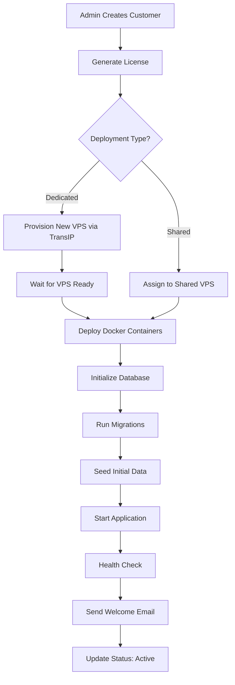
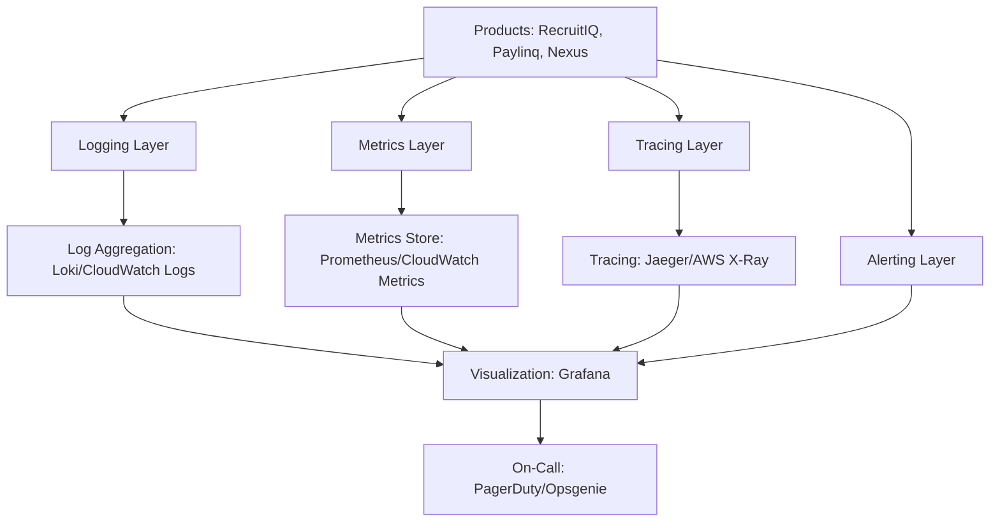
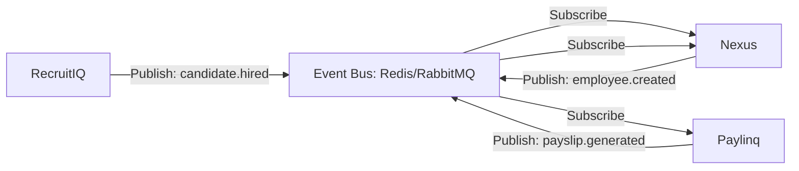
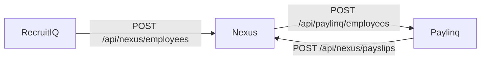
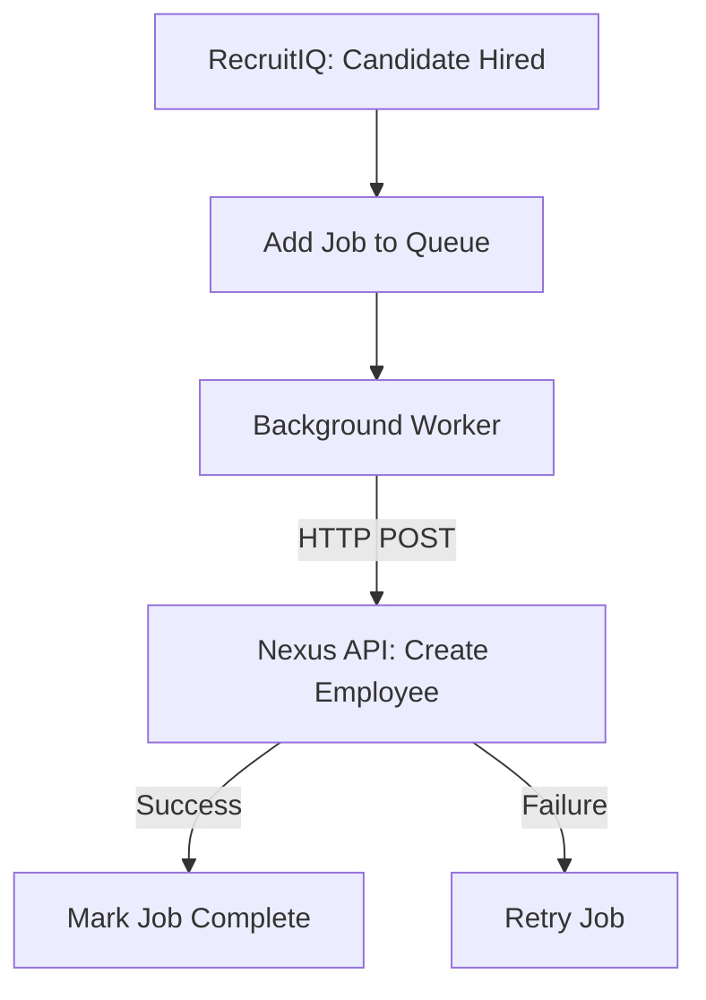
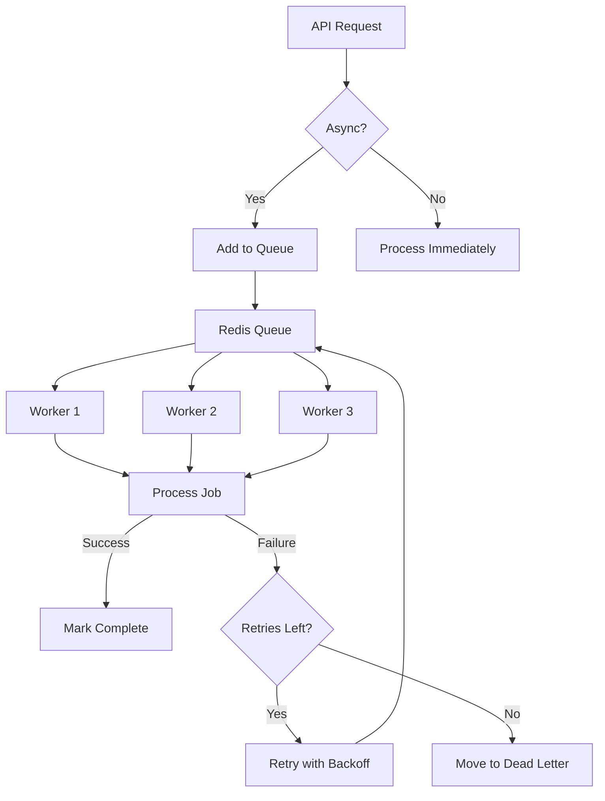
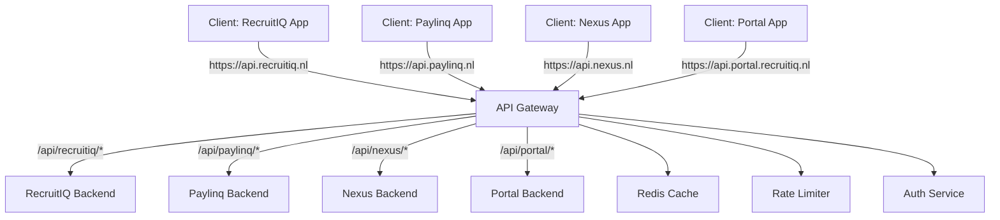

# Integration Architecture Analysis

**Document Version:** 1.0  
**Last Updated:** November 3, 2025  
**Status:** In Progress  
**Author:** Development Team

---

## Table of Contents

1. [Executive Summary](#executive-summary)
2. [Current External Integrations](#current-external-integrations)
3. [Infrastructure & Provisioning](#infrastructure--provisioning)
4. [Monitoring & Observability](#monitoring--observability)
5. [Inter-Product Communication](#inter-product-communication)
6. [Event-Driven Architecture](#event-driven-architecture)
7. [Webhook Infrastructure](#webhook-infrastructure)
8. [Message Queue System](#message-queue-system)
9. [API Gateway & Service Mesh](#api-gateway--service-mesh)
10. [Integration Security](#integration-security)
11. [Third-Party Integration Points](#third-party-integration-points)
12. [Migration Strategy](#migration-strategy)

---

## 1. Executive Summary

### Current State
RecruitIQ currently has **minimal external integrations** with infrastructure focused on self-hosting and basic monitoring capabilities:

**Existing Integrations:**
- ✅ File Storage (Local + AWS S3)
- ✅ Email (Nodemailer - SMTP ready, not configured)
- ✅ VPS Management (TransIP API - stub implementation)
- ✅ Monitoring (CloudWatch + Datadog - stub implementations)
- ❌ No event bus or message queue
- ❌ No webhook infrastructure
- ❌ No inter-service communication

### Key Findings

**Strengths:**
- ✅ Modular integration design (separate service classes)
- ✅ File storage abstraction (local/S3 switchable)
- ✅ VPS management database schema in place
- ✅ Security logging infrastructure
- ✅ Redis available for caching/queuing

**Weaknesses:**
- ❌ TransIP API integration not implemented
- ❌ Email service not configured
- ❌ No event-driven architecture
- ❌ No message queue for async processing
- ❌ No webhook system for external integrations
- ❌ No API gateway for multi-product routing

**Critical Needs for Multi-Product:**
1. **Event Bus** - Product-to-product communication (RecruitIQ ↔ Paylinq ↔ Nexus)
2. **Message Queue** - Async job processing (payroll runs, bulk operations)
3. **Webhook System** - External integrations (accounting, HRIS, payroll services)
4. **API Gateway** - Unified entry point with product routing
5. **Service Mesh** - Service discovery and load balancing

---

## 2. Current External Integrations

### 2.1 File Storage Integration

**Service:** `backend/src/utils/fileStorage.js`  
**Status:** ✅ Fully Implemented  
**Storage Types:** Local filesystem + AWS S3

**Features:**
- Secure filename generation with UUID
- Automatic directory structure (`orgId/year/month/uuid.ext`)
- File hash calculation (SHA256) for integrity
- S3 encryption at rest (AES256)
- Signed URL generation for temporary access
- Organization-based namespacing

**Configuration:**
```javascript
// Environment variables
FILE_STORAGE_TYPE=local|s3
FILE_STORAGE_PATH=/path/to/uploads  // Local only
AWS_REGION=us-east-1                 // S3 only
AWS_S3_BUCKET=recruitiq-uploads      // S3 only
AWS_ACCESS_KEY_ID=...                // S3 only
AWS_SECRET_ACCESS_KEY=...            // S3 only
```

**Current Usage:**
- Resume/CV uploads
- Application documents
- Interview feedback attachments
- Job posting images

**Dependencies:**
```json
{
  "aws-sdk": "^2.1501.0",
  "multer": "^2.0.2",
  "uuid": "^13.0.0"
}
```

**API Methods:**
- `upload({ buffer, originalFilename, contentType, organizationId, userId })`
- `retrieve(securePath)`
- `delete(securePath)`
- `getSignedUrl(securePath, expiresIn)`
- `exists(securePath)`
- `getMetadata(securePath)`

**Security Features:**
- ✅ Secure filename sanitization
- ✅ Organization-based isolation
- ✅ File hash verification
- ✅ Server-side encryption (S3)
- ✅ Signed URLs with expiration (S3)
- ✅ MIME type validation (via Multer middleware)

### 2.2 Email Integration (SMTP)

**Service:** Not yet implemented (Nodemailer installed)  
**Status:** ⚠️ Stub/Placeholder  
**Package:** `nodemailer` v7.0.10

**Planned Email Types:**
1. **Recruitment Emails (RecruitIQ):**
   - Interview invitations
   - Application status updates
   - Candidate communications
   - Job alerts

2. **Payroll Emails (Paylinq):**
   - Payslip delivery
   - Payment confirmations
   - Tax document notifications

3. **HRIS Emails (Nexus):**
   - Leave approval notifications
   - Contract reminders
   - Policy updates
   - Employee onboarding

4. **System Emails (All Products):**
   - Password reset
   - MFA setup
   - Session alerts
   - Security notifications

**Recommended Configuration:**
```javascript
// config/email.js
export default {
  smtp: {
    host: process.env.SMTP_HOST || 'smtp.sendgrid.net',
    port: process.env.SMTP_PORT || 587,
    secure: process.env.SMTP_SECURE === 'true', // TLS
    auth: {
      user: process.env.SMTP_USER,
      pass: process.env.SMTP_PASS,
    },
  },
  from: {
    recruitiq: 'RecruitIQ <noreply@recruitiq.com>',
    paylinq: 'Paylinq <noreply@paylinq.com>',
    nexus: 'Nexus <noreply@nexus.com>',
    system: 'RecruitIQ Platform <system@recruitiq.com>',
  },
  templates: {
    engine: 'handlebars', // or 'ejs'
    path: 'src/templates/email',
  },
  queue: {
    enabled: true, // Use Bull queue for async sending
    attempts: 3,
    backoff: 5000, // 5 seconds
  },
}
```

**Implementation Needed:**
```javascript
// services/email/EmailService.js
class EmailService {
  constructor() {
    this.transporter = nodemailer.createTransport(config.smtp)
    this.queue = new EmailQueue() // Bull queue
  }
  
  async send({ to, subject, html, text, product = 'system' }) {
    // Add to queue for async processing
    return this.queue.add('send-email', {
      from: config.from[product],
      to,
      subject,
      html,
      text,
    })
  }
  
  async sendTemplate({ to, template, data, product = 'system' }) {
    const html = await this.renderTemplate(template, data)
    const text = await this.renderTemplate(`${template}.txt`, data)
    return this.send({ to, subject: data.subject, html, text, product })
  }
}
```

### 2.3 Monitoring & Observability (Stub)

**Services:**
- `backend/src/integrations/cloudwatch.js` (AWS CloudWatch)
- `backend/src/integrations/datadog.js` (Datadog)

**Status:** ⚠️ Stub Implementation  
**Current State:** Framework in place, but not actively used

**CloudWatch Integration:**
```javascript
// Features (stub)
- putMetric(metricName, value, unit, dimensions)
- putSecurityEvent(event)
- putAlert(alert)

// Metrics tracked:
- SecurityEvents (by type, severity)
- FailedLogins (by IP)
- BruteForceAttempts (by IP)
- RateLimitViolations (by endpoint)
- SQLInjectionAttempts (by endpoint)
- XSSAttempts (by endpoint)
```

**Datadog Integration:**
```javascript
// Features (stub)
- sendMetric(metricName, value, type, tags)
- sendEvent(title, text, alertType, tags)
- sendSecurityEvent(event)
- sendAlert(alert)
- healthCheck()
```

**Recommendation:** Implement one monitoring solution based on infrastructure:
- **AWS Infrastructure:** CloudWatch (tightly integrated)
- **Multi-Cloud:** Datadog (vendor-agnostic)
- **Self-Hosted:** Prometheus + Grafana (cost-effective)

---

## 3. Infrastructure & Provisioning

### 3.1 TransIP VPS API Integration

**Service:** `backend/src/services/transip.js`  
**Status:** ⚠️ Stub Implementation (TODO comments throughout)

**Purpose:** Automated VPS provisioning for dedicated tenants

**Planned Functionality:**
```javascript
// Create dedicated VPS for organization
createDedicatedVPS(config) {
  // config: { organizationId, slug, tier }
  // Returns: { vpsName, ipAddress, status, hostname }
}

// Get VPS specifications by tier
getVPSSpecs(tier) {
  // starter: 1 CPU, 2GB RAM, 50GB disk
  // professional: 2 CPU, 4GB RAM, 100GB disk
  // enterprise: 4 CPU, 8GB RAM, 200GB disk
}

// Cloud-init script for auto-setup
getCloudInitScript(config) {
  // Installs: Docker, Docker Compose, SSL (Certbot)
  // Configures: Firewall, .env file, database
  // Pulls and starts Docker containers
}

// VPS operations
getVPSStatus(vpsName)
stopVPS(vpsName)
startVPS(vpsName)
deleteVPS(vpsName)
createSnapshot(vpsName, description)
```

**Integration TODO:**
```bash
# Install TransIP API package
npm install @transip/transip-api-javascript

# Configuration needed
TRANSIP_USERNAME=your_username
TRANSIP_PRIVATE_KEY=path/to/private.key
```

**VPS Product Mapping:**
| Tier | TransIP Product | vCPU | RAM | Disk |
|------|----------------|------|-----|------|
| Starter | vps-bladevps-x2 | 1 | 2GB | 50GB |
| Professional | vps-bladevps-x4 | 2 | 4GB | 100GB |
| Enterprise | vps-bladevps-x8 | 4 | 8GB | 200GB |

### 3.2 VPS Management Service

**Service:** `backend/src/services/vpsManager.js`  
**Status:** ✅ Fully Implemented  
**Database:** `vps_instances` table

**Features:**
- VPS registration and tracking
- Capacity management (shared VPS)
- Organization assignment
- Health metrics tracking
- Auto-selection for optimal load balancing

**Key Methods:**
```javascript
// Register new VPS
registerVPS(vpsData)

// Get available shared VPS (with capacity)
getAvailableSharedVPS()

// Auto-select optimal VPS (least loaded)
getOptimalSharedVPS()

// Assign organization to VPS
assignOrganizationToVPS(organizationId, vpsId)

// Update health metrics
updateVPSHealth(vpsId, { cpu, memory, disk })

// Get VPS statistics
getVPSStatistics() // Returns: total_vps, shared_vps, dedicated_vps, total_tenants, avg_cpu_usage, etc.
```

**VPS Database Schema:**
```sql
CREATE TABLE vps_instances (
  id UUID PRIMARY KEY DEFAULT gen_random_uuid(),
  vps_name VARCHAR(255) UNIQUE NOT NULL,
  vps_ip VARCHAR(45) NOT NULL,
  hostname VARCHAR(255),
  deployment_type VARCHAR(20) CHECK (deployment_type IN ('shared', 'dedicated')),
  organization_id UUID REFERENCES organizations(id),  -- For dedicated VPS
  location VARCHAR(100),
  cpu_cores INTEGER,
  memory_mb INTEGER,
  disk_gb INTEGER,
  max_tenants INTEGER DEFAULT 20,
  current_tenants INTEGER DEFAULT 0,
  cpu_usage_percent DECIMAL(5,2),
  memory_usage_percent DECIMAL(5,2),
  disk_usage_percent DECIMAL(5,2),
  status VARCHAR(20) DEFAULT 'active',
  last_health_check TIMESTAMP,
  notes TEXT,
  created_at TIMESTAMP DEFAULT NOW(),
  updated_at TIMESTAMP DEFAULT NOW()
);
```

**Deployment Types:**
1. **Shared VPS:** Multiple tenants (up to 20), load-balanced
2. **Dedicated VPS:** Single organization, full resources

### 3.3 Client Provisioning Workflow

**Current Flow:**
1. Admin creates customer via Portal UI
2. `POST /api/portal/clients` endpoint called
3. License generated and stored in database
4. Organization record created
5. VPS assignment (manual or automatic)
6. TODO: Docker container deployment
7. TODO: Database initialization
8. TODO: Application startup

**Planned Automated Flow:**


**Deployment Service Needed:**
```javascript
// deployment-service/src/services/DeploymentService.js
class DeploymentService {
  async deployTenant(config) {
    const { organizationId, deploymentType, tier, vpsId } = config
    
    // 1. Provision infrastructure
    let vps
    if (deploymentType === 'dedicated') {
      vps = await transipService.createDedicatedVPS(config)
      await this.waitForVPSReady(vps.vpsName)
    } else {
      vps = await vpsManager.getOptimalSharedVPS()
      await vpsManager.assignOrganizationToVPS(organizationId, vps.id)
    }
    
    // 2. Deploy application via SSH/Docker API
    await this.deployDockerContainers(vps, config)
    
    // 3. Initialize database
    await this.initializeDatabase(vps, config)
    
    // 4. Run migrations
    await this.runMigrations(vps, config)
    
    // 5. Health check
    const healthy = await this.healthCheck(vps, config)
    
    if (!healthy) {
      throw new Error('Deployment failed health check')
    }
    
    // 6. Update organization status
    await this.updateOrganizationStatus(organizationId, 'active')
    
    // 7. Send welcome email
    await emailService.sendTemplate({
      to: config.contactEmail,
      template: 'welcome',
      data: { organizationName: config.name, instanceUrl: `https://${config.slug}.recruitiq.nl` },
      product: 'system'
    })
    
    return { vps, instanceUrl: `https://${config.slug}.recruitiq.nl` }
  }
}
```

---

## 4. Monitoring & Observability

### 4.1 Current Monitoring Implementation

**Status:** ⚠️ Stub implementations exist but not actively used

#### CloudWatch Integration
**File:** `backend/src/integrations/cloudwatch.js` (180 lines)

**Features:**
```javascript
// Metrics
putMetric(metricName, value, unit = 'Count', dimensions = [])
putSecurityEvent(event) // Wrapper for security metrics
putAlert(alert) // Wrapper for alert metrics

// Namespace: RecruitIQ/Security
// Available metrics:
- SecurityEvents (by type, severity, organizationId)
- FailedLogins (by IP)
- BruteForceAttempts (by IP)
- RateLimitViolations (by endpoint)
- SQLInjectionAttempts (by endpoint)
- XSSAttempts (by endpoint)
```

**Configuration:**
```javascript
monitoring: {
  cloudwatch: {
    enabled: process.env.MONITORING_CLOUDWATCH_ENABLED === 'true',
    region: process.env.AWS_REGION || 'us-east-1',
    namespace: 'RecruitIQ/Security'
  }
}
```

#### Datadog Integration
**File:** `backend/src/integrations/datadog.js` (280 lines)

**Features:**
```javascript
// Metrics API
sendMetric(metricName, value, type = 'gauge', tags = [])

// Events API
sendEvent(title, text, alertType = 'info', tags = [])

// Security events
sendSecurityEvent(event)

// Alerts
sendAlert(alert)

// Health check
healthCheck() // GET /api/v1/validate
```

**Configuration:**
```javascript
monitoring: {
  datadog: {
    enabled: process.env.MONITORING_DATADOG_ENABLED === 'true',
    apiKey: process.env.DATADOG_API_KEY,
    appKey: process.env.DATADOG_APP_KEY,
    site: process.env.DATADOG_SITE || 'datadoghq.com',
    service: 'recruitiq'
  }
}
```

### 4.2 Recommended Monitoring Architecture

**For Multi-Product SaaS:**



**Recommended Stack (Cost-Effective):**
1. **Logs:** Loki (self-hosted) or CloudWatch Logs
2. **Metrics:** Prometheus (self-hosted) or CloudWatch Metrics
3. **Tracing:** Jaeger (self-hosted) or AWS X-Ray
4. **Visualization:** Grafana (self-hosted)
5. **Alerting:** Grafana Alerting + PagerDuty

**Recommended Stack (Managed):**
1. **All-in-one:** Datadog ($$$$)
2. **AWS-native:** CloudWatch + X-Ray ($$$)
3. **Hybrid:** Grafana Cloud ($$)

### 4.3 Key Metrics to Track

**Product Metrics:**
```yaml
RecruitIQ:
  - job_postings_created_total
  - applications_received_total
  - interviews_scheduled_total
  - candidates_hired_total
  - time_to_hire_seconds
  - application_conversion_rate

Paylinq:
  - payroll_runs_total
  - payroll_run_duration_seconds
  - payments_processed_total
  - payment_failures_total
  - payslips_generated_total

Nexus:
  - employees_active_total
  - leave_requests_total
  - leave_approval_time_seconds
  - contract_renewals_due_30days
  - policy_acknowledgements_total
```

**System Metrics:**
```yaml
Performance:
  - http_request_duration_seconds
  - http_requests_total
  - database_query_duration_seconds
  - database_connections_active
  - cache_hit_rate
  - queue_job_duration_seconds
  - queue_jobs_waiting_total

Security:
  - failed_login_attempts_total
  - mfa_verifications_total
  - rate_limit_violations_total
  - sql_injection_attempts_total
  - csrf_token_validations_total

Infrastructure:
  - vps_cpu_usage_percent
  - vps_memory_usage_percent
  - vps_disk_usage_percent
  - vps_tenants_current
  - deployment_duration_seconds
```

---

## 5. Inter-Product Communication

### 5.1 Current State

**Status:** ❌ No inter-service communication exists

**Current Architecture:** Monolithic application with all features in one codebase

### 5.2 Planned Communication Patterns

**Products and Dependencies:**
```
RecruitIQ (Recruitment) 
  ↓
Nexus (HRIS) → Hired candidates become employees
  ↓
Paylinq (Payroll) → Employee data for payroll processing
```

**Communication Requirements:**

1. **RecruitIQ → Nexus:**
   - Event: Candidate hired
   - Data: Personal info, contract details, start date
   - Frequency: Low (1-10 per day per customer)
   - Latency: Acceptable (< 5 seconds)

2. **Nexus → Paylinq:**
   - Event: Employee created/updated
   - Data: Salary, bank account, tax info
   - Frequency: Low (1-10 per day per customer)
   - Latency: Acceptable (< 5 seconds)

3. **Nexus → Paylinq (Scheduled):**
   - Event: Monthly payroll trigger
   - Data: Employee list, hours worked, leave taken
   - Frequency: Monthly (or bi-weekly)
   - Latency: Can be batched

4. **Paylinq → Nexus:**
   - Event: Payslip generated
   - Data: Payslip PDF, payment details
   - Frequency: Monthly bulk (100s per customer)
   - Latency: Acceptable (batched)

### 5.3 Communication Architecture Options

#### Option A: Event-Driven (Recommended)

**Pattern:** Publish-Subscribe via Message Broker



**Benefits:**
- ✅ Loose coupling between products
- ✅ Asynchronous processing (non-blocking)
- ✅ Event replay capability
- ✅ Easy to add new products
- ✅ Built-in resilience (retries, dead-letter queues)

**Drawbacks:**
- ❌ More complex infrastructure
- ❌ Eventual consistency
- ❌ Debugging can be harder

**Implementation:** Redis Streams or RabbitMQ

#### Option B: Direct HTTP API Calls

**Pattern:** Synchronous REST API calls between products



**Benefits:**
- ✅ Simple to implement
- ✅ Immediate consistency
- ✅ Easy to debug

**Drawbacks:**
- ❌ Tight coupling
- ❌ Cascading failures
- ❌ Synchronous (blocking)
- ❌ No retry mechanism

**Use Case:** Simple deployments with all products on same VPS

#### Option C: Hybrid Approach (Recommended for MVP)

**Pattern:** HTTP APIs + Background Jobs



**Benefits:**
- ✅ Simple to implement (no message broker)
- ✅ Asynchronous (non-blocking)
- ✅ Built-in retries via Bull queue
- ✅ Uses existing Redis infrastructure

**Drawbacks:**
- ❌ Tighter coupling than event bus
- ❌ No event replay

**Recommendation:** Start with Option C (Hybrid), migrate to Option A (Event-Driven) as scale increases.

### 5.4 Event Schema Design

**Base Event Structure:**
```typescript
interface BaseEvent {
  eventId: string;           // UUID
  eventType: string;         // e.g., "candidate.hired"
  eventVersion: string;      // e.g., "1.0"
  sourceProduct: string;     // "recruitiq" | "paylinq" | "nexus"
  sourceOrganizationId: string; // UUID
  timestamp: string;         // ISO 8601
  correlationId?: string;    // For tracking workflows
  payload: Record<string, any>;
}
```

**Example Events:**

```typescript
// RecruitIQ → Nexus: Candidate Hired
{
  eventType: "candidate.hired",
  eventVersion: "1.0",
  sourceProduct: "recruitiq",
  sourceOrganizationId: "org-123",
  timestamp: "2025-11-03T10:30:00Z",
  payload: {
    candidateId: "cand-456",
    firstName: "John",
    lastName: "Doe",
    email: "john.doe@example.com",
    phone: "+31612345678",
    jobId: "job-789",
    jobTitle: "Software Engineer",
    startDate: "2025-12-01",
    contractType: "full-time",
    salary: 60000,
    currency: "EUR"
  }
}

// Nexus → Paylinq: Employee Created
{
  eventType: "employee.created",
  eventVersion: "1.0",
  sourceProduct: "nexus",
  sourceOrganizationId: "org-123",
  timestamp: "2025-11-03T10:31:00Z",
  correlationId: "cand-456", // Links to candidate.hired event
  payload: {
    employeeId: "emp-999",
    firstName: "John",
    lastName: "Doe",
    email: "john.doe@example.com",
    bankAccount: {
      iban: "NL91ABNA0417164300",
      bic: "ABNANL2A"
    },
    taxId: "123456789",
    salary: {
      amount: 60000,
      currency: "EUR",
      frequency: "annual"
    },
    startDate: "2025-12-01",
    contractType: "full-time"
  }
}

// Paylinq → Nexus: Payslip Generated
{
  eventType: "payslip.generated",
  eventVersion: "1.0",
  sourceProduct: "paylinq",
  sourceOrganizationId: "org-123",
  timestamp: "2025-11-30T23:59:00Z",
  payload: {
    payslipId: "payslip-111",
    employeeId: "emp-999",
    period: {
      year: 2025,
      month: 11
    },
    grossPay: 5000,
    netPay: 3500,
    deductions: {
      tax: 1000,
      socialSecurity: 500
    },
    paymentDate: "2025-11-30",
    pdfUrl: "https://storage.recruitiq.nl/org-123/payslips/2025/11/payslip-111.pdf"
  }
}
```

---

## 6. Event-Driven Architecture

### 6.1 Recommended Event Bus Architecture

**Technology:** Redis Streams (leverages existing Redis infrastructure)

**Why Redis Streams?**
- ✅ Already have Redis for caching
- ✅ Simpler than RabbitMQ/Kafka
- ✅ Built-in consumer groups
- ✅ Message persistence
- ✅ Low latency
- ✅ Good for moderate scale (< 10K events/sec per stream)

**Alternative:** RabbitMQ (if need advanced routing, federation)

### 6.2 Event Bus Implementation

**Service:** `backend/src/shared/services/EventBus.js`

```javascript
import Redis from 'ioredis';
import { v4 as uuidv4 } from 'uuid';
import logger from '../utils/logger.js';

class EventBus {
  constructor() {
    this.redis = new Redis({
      host: process.env.REDIS_HOST || 'localhost',
      port: process.env.REDIS_PORT || 6379,
      password: process.env.REDIS_PASSWORD,
      maxRetriesPerRequest: null, // Required for streams
    });
    
    this.subscribers = new Map(); // eventType → handlers[]
    this.consumerGroup = process.env.SERVICE_NAME || 'recruitiq';
    this.consumerId = `${this.consumerGroup}-${process.pid}`;
  }
  
  /**
   * Publish an event to the event bus
   */
  async publish(eventType, payload, options = {}) {
    const event = {
      eventId: uuidv4(),
      eventType,
      eventVersion: options.version || '1.0',
      sourceProduct: process.env.PRODUCT_NAME || 'recruitiq',
      sourceOrganizationId: options.organizationId,
      timestamp: new Date().toISOString(),
      correlationId: options.correlationId,
      payload,
    };
    
    const streamKey = `events:${eventType}`;
    
    try {
      const messageId = await this.redis.xadd(
        streamKey,
        'MAXLEN', '~', 10000, // Keep last ~10K messages
        '*', // Auto-generate ID
        'data', JSON.stringify(event)
      );
      
      logger.info(`Published event: ${eventType}`, {
        eventId: event.eventId,
        messageId,
        organizationId: event.sourceOrganizationId,
      });
      
      return { eventId: event.eventId, messageId };
    } catch (error) {
      logger.error(`Failed to publish event: ${eventType}`, { error, event });
      throw error;
    }
  }
  
  /**
   * Subscribe to an event type
   */
  async subscribe(eventType, handler) {
    if (!this.subscribers.has(eventType)) {
      this.subscribers.set(eventType, []);
    }
    
    this.subscribers.get(eventType).push(handler);
    
    // Create consumer group if not exists
    const streamKey = `events:${eventType}`;
    try {
      await this.redis.xgroup(
        'CREATE',
        streamKey,
        this.consumerGroup,
        '0', // Start from beginning
        'MKSTREAM' // Create stream if not exists
      );
    } catch (error) {
      if (!error.message.includes('BUSYGROUP')) {
        logger.error(`Failed to create consumer group: ${eventType}`, { error });
      }
    }
    
    logger.info(`Subscribed to event: ${eventType}`, {
      consumerGroup: this.consumerGroup,
      consumerId: this.consumerId,
    });
  }
  
  /**
   * Start consuming events (should be called once per process)
   */
  async startConsuming() {
    logger.info('Starting event consumer', {
      consumerGroup: this.consumerGroup,
      consumerId: this.consumerId,
      subscribedEvents: Array.from(this.subscribers.keys()),
    });
    
    while (true) {
      for (const [eventType, handlers] of this.subscribers.entries()) {
        const streamKey = `events:${eventType}`;
        
        try {
          // Read from consumer group (blocked events)
          const messages = await this.redis.xreadgroup(
            'GROUP', this.consumerGroup, this.consumerId,
            'COUNT', 10,
            'BLOCK', 1000, // 1 second timeout
            'STREAMS', streamKey, '>'
          );
          
          if (!messages) continue;
          
          for (const [stream, streamMessages] of messages) {
            for (const [messageId, fields] of streamMessages) {
              const eventData = JSON.parse(fields[1]); // fields = ['data', '...']
              
              // Process event with all registered handlers
              for (const handler of handlers) {
                try {
                  await handler(eventData);
                  logger.debug(`Processed event: ${eventType}`, {
                    eventId: eventData.eventId,
                    messageId,
                  });
                } catch (error) {
                  logger.error(`Handler failed for event: ${eventType}`, {
                    eventId: eventData.eventId,
                    messageId,
                    error,
                  });
                  // Continue to other handlers
                }
              }
              
              // Acknowledge message
              await this.redis.xack(streamKey, this.consumerGroup, messageId);
            }
          }
        } catch (error) {
          logger.error(`Failed to consume events: ${eventType}`, { error });
          await new Promise(resolve => setTimeout(resolve, 5000)); // Back off 5s
        }
      }
    }
  }
  
  /**
   * Close Redis connection
   */
  async close() {
    await this.redis.quit();
  }
}

export default new EventBus();
```

### 6.3 Usage Example

**Publishing Events:**
```javascript
// RecruitIQ: When candidate is hired
import eventBus from '../shared/services/EventBus.js';

// In candidateController.js
async function hireCandidate(req, res) {
  const { candidateId } = req.params;
  const candidate = await candidateService.hire(candidateId);
  
  // Publish event for Nexus to consume
  await eventBus.publish('candidate.hired', {
    candidateId: candidate.id,
    firstName: candidate.first_name,
    lastName: candidate.last_name,
    email: candidate.email,
    phone: candidate.phone,
    jobId: candidate.job_id,
    jobTitle: candidate.job_title,
    startDate: candidate.start_date,
    contractType: candidate.contract_type,
    salary: candidate.salary,
    currency: candidate.currency,
  }, {
    organizationId: req.user.organizationId,
  });
  
  res.json({ success: true, candidate });
}
```

**Subscribing to Events:**
```javascript
// Nexus: Listen for hired candidates
import eventBus from '../shared/services/EventBus.js';
import employeeService from './services/employeeService.js';

// In nexus/src/events/candidateHiredHandler.js
async function handleCandidateHired(event) {
  const { payload, sourceOrganizationId, correlationId } = event;
  
  logger.info('Received candidate.hired event', {
    candidateId: payload.candidateId,
    organizationId: sourceOrganizationId,
  });
  
  // Create employee record in Nexus
  const employee = await employeeService.create({
    organizationId: sourceOrganizationId,
    firstName: payload.firstName,
    lastName: payload.lastName,
    email: payload.email,
    phone: payload.phone,
    jobTitle: payload.jobTitle,
    startDate: payload.startDate,
    contractType: payload.contractType,
    salary: payload.salary,
    currency: payload.currency,
    sourceSystem: 'recruitiq',
    sourceId: payload.candidateId,
  });
  
  // Publish employee.created event for Paylinq
  await eventBus.publish('employee.created', {
    employeeId: employee.id,
    ...employee,
  }, {
    organizationId: sourceOrganizationId,
    correlationId: payload.candidateId, // Link back to candidate
  });
}

// Register handler (in app startup)
eventBus.subscribe('candidate.hired', handleCandidateHired);
eventBus.startConsuming(); // Start consuming in background
```

### 6.4 Event Versioning Strategy

**Problem:** Event schemas will evolve over time

**Solution:** Semantic versioning + backward compatibility

```javascript
// Version 1.0
{
  eventType: "candidate.hired",
  eventVersion: "1.0",
  payload: {
    candidateId: "...",
    firstName: "...",
    lastName: "..."
  }
}

// Version 2.0 (added middleName field)
{
  eventType: "candidate.hired",
  eventVersion: "2.0",
  payload: {
    candidateId: "...",
    firstName: "...",
    middleName: "...",  // NEW FIELD
    lastName: "..."
  }
}
```

**Handler Implementation:**
```javascript
async function handleCandidateHired(event) {
  const { eventVersion, payload } = event;
  
  // Support multiple versions
  if (eventVersion === '1.0') {
    return handleCandidateHiredV1(payload);
  } else if (eventVersion === '2.0') {
    return handleCandidateHiredV2(payload);
  } else {
    logger.warn(`Unknown event version: ${eventVersion}`);
    // Attempt to process with latest handler
    return handleCandidateHiredV2(payload);
  }
}
```

**Versioning Rules:**
- Major version (1.x → 2.x): Breaking changes (remove fields)
- Minor version (1.0 → 1.1): New fields (backward compatible)
- Patch version (1.0.0 → 1.0.1): Bug fixes

---

## 7. Webhook Infrastructure

### 7.1 Current State

**Status:**  No webhook infrastructure exists

**Need:** Both incoming and outgoing webhooks for third-party integrations

### 7.2 Webhook Requirements

#### Incoming Webhooks (Third-Party  RecruitIQ)

**Use Cases:**
1. **Job Board Integrations:**
   - LinkedIn job postings
   - Indeed application notifications
   - Monster candidate updates

2. **Background Check Services:**
   - Checkr results
   - Sterling verification complete

3. **Assessment Platforms:**
   - Codility test results
   - HackerRank scores

4. **Payment Gateways (Paylinq):**
   - Stripe payment confirmations
   - PayPal transaction webhooks
   - Mollie payment status

5. **Accounting Integrations (Paylinq):**
   - Exact Online sync webhooks
   - Twinfield updates
   - AFAS connector

#### Outgoing Webhooks (RecruitIQ  Customer Systems)

**Use Cases:**
1. **Candidate Events:**
   - Application received
   - Interview scheduled
   - Candidate hired/rejected
   - Onboarding status

2. **Payroll Events (Paylinq):**
   - Payroll run completed
   - Payslip generated
   - Payment processed
   - Tax filing complete

3. **Employee Events (Nexus):**
   - New hire onboarded
   - Leave request approved
   - Contract expiring
   - Performance review due

### 7.3 Webhook Service Architecture

**Incoming Webhook Flow:**
`mermaid
graph LR
    A[Third-Party Service] -->|POST /webhooks/:provider/:type| B[API Gateway]
    B --> C[Webhook Validator]
    C -->|Verify Signature| D{Valid?}
    D -->|No| E[Return 401]
    D -->|Yes| F[Add to Queue]
    F --> G[Background Worker]
    G --> H[Process Webhook]
    H --> I[Trigger Internal Event]
    I --> J[EventBus]
---
## 7. Webhook Infrastructure (Continued)
### 7.3 Webhook Service Implementation
**File:** `backend/src/shared/services/WebhookService.js`
```javascript
import crypto from 'crypto';
import Bull from 'bull';
import logger from '../utils/logger.js';
import eventBus from './EventBus.js';
class WebhookService {
  constructor() {
    this.queue = new Bull('webhooks', {
      redis: {
        host: process.env.REDIS_HOST || 'localhost',
        port: process.env.REDIS_PORT || 6379,
      },
    });
    // Process webhook jobs
    this.queue.process(10, async (job) => {
      return this.processWebhook(job.data);
    });
    // Outgoing webhook registry
    this.subscriptions = new Map(); // organizationId → webhooks[]
  }
  /**
   * Validate incoming webhook signature
   */
  validateSignature(provider, payload, signature, secret) {
    switch (provider) {
      case 'stripe':
        return this.validateStripeSignature(payload, signature, secret);
      case 'mollie':
        return this.validateMollieSignature(payload, signature, secret);
      case 'linkedin':
        return this.validateLinkedInSignature(payload, signature, secret);
      default:
        throw new Error(`Unknown provider: ${provider}`);
    }
  }
  /**
   * Validate Stripe webhook signature
   */
  validateStripeSignature(payload, signature, secret) {
    const expectedSignature = crypto
      .createHmac('sha256', secret)
      .update(payload)
      .digest('hex');
    return crypto.timingSafeEqual(
      Buffer.from(signature),
      Buffer.from(expectedSignature)
    );
  }
  /**
   * Queue incoming webhook for processing
   */
  async queueIncomingWebhook(provider, type, payload, metadata = {}) {
    const job = await this.queue.add('incoming', {
      provider,
      type,
      payload,
      metadata,
      receivedAt: new Date().toISOString(),
    }, {
      attempts: 3,
      backoff: {
        type: 'exponential',
        delay: 5000, // Start with 5s
      },
    });
    logger.info(`Queued incoming webhook: ${provider}.${type}`, {
      jobId: job.id,
      provider,
      type,
    });
    return job;
  }
  /**
   * Process incoming webhook
   */
  async processWebhook(data) {
    const { provider, type, payload, metadata } = data;
    logger.info(`Processing webhook: ${provider}.${type}`, {
      provider,
      type,
      organizationId: metadata.organizationId,
    });
    try {
      // Route to appropriate handler
      const handler = this.getWebhookHandler(provider, type);
      if (!handler) {
        logger.warn(`No handler found for webhook: ${provider}.${type}`);
        return;
      }
      const result = await handler(payload, metadata);
      // Publish internal event for further processing
      if (result.event) {
        await eventBus.publish(result.event.type, result.event.payload, {
          organizationId: metadata.organizationId,
          correlationId: result.event.correlationId,
        });
      }
      logger.info(`Processed webhook: ${provider}.${type}`, {
        provider,
        type,
        success: true,
      });
      return result;
    } catch (error) {
      logger.error(`Failed to process webhook: ${provider}.${type}`, {
        provider,
        type,
        error,
      });
      throw error; // Bull will retry
    }
  }
  /**
   * Register webhook subscription (outgoing)
   */
  async registerWebhook(organizationId, config) {
    const {
      url,
      events,
      secret,
      active = true,
      metadata = {},
    } = config;
    // Store in database
    const webhook = await this.db.query(
      `INSERT INTO webhook_subscriptions 
       (organization_id, url, events, secret, active, metadata)
       VALUES ($1, $2, $3, $4, $5, $6)
       RETURNING *`,
      [organizationId, url, JSON.stringify(events), secret, active, JSON.stringify(metadata)]
    );
    logger.info('Registered webhook subscription', {
      webhookId: webhook.id,
      organizationId,
      url,
      events,
    });
    return webhook;
  }
  /**
   * Trigger outgoing webhooks for an event
   */
  async triggerWebhooks(eventType, payload, organizationId) {
    // Get all active webhooks for this organization and event type
    const webhooks = await this.db.query(
      `SELECT * FROM webhook_subscriptions
       WHERE organization_id = $1
       AND active = true
       AND events @> $2`,
      [organizationId, JSON.stringify([eventType])]
    );
    if (webhooks.length === 0) {
      logger.debug(`No webhooks registered for event: ${eventType}`, {
        organizationId,
        eventType,
      });
      return;
    }
    // Queue delivery jobs for each webhook
    const jobs = webhooks.map(webhook => 
      this.queue.add('outgoing', {
        webhookId: webhook.id,
        url: webhook.url,
        eventType,
        payload,
        secret: webhook.secret,
        organizationId,
      }, {
        attempts: 5,
        backoff: {
          type: 'exponential',
          delay: 10000, // Start with 10s
        },
      })
    );
    return Promise.all(jobs);
  }
  /**
   * Deliver outgoing webhook
   */
  async deliverWebhook(data) {
    const { webhookId, url, eventType, payload, secret } = data;
    const webhookPayload = {
      id: crypto.randomUUID(),
      event: eventType,
      created: Math.floor(Date.now() / 1000),
      data: payload,
    };
    const payloadString = JSON.stringify(webhookPayload);
    // Sign payload
    const signature = crypto
      .createHmac('sha256', secret)
      .update(payloadString)
      .digest('hex');
    // Send HTTP POST request
    const response = await fetch(url, {
      method: 'POST',
      headers: {
        'Content-Type': 'application/json',
        'X-Webhook-Signature': signature,
        'X-Webhook-Event': eventType,
        'User-Agent': 'RecruitIQ-Webhook/1.0',
      },
      body: payloadString,
      timeout: 30000, // 30 seconds
    });
    if (!response.ok) {
      throw new Error(`Webhook delivery failed: ${response.status} ${response.statusText}`);
    }
    // Log successful delivery
    await this.db.query(
      `INSERT INTO webhook_deliveries
       (webhook_id, event_type, payload, response_status, delivered_at)
       VALUES ($1, $2, $3, $4, NOW())`,
      [webhookId, eventType, payloadString, response.status]
    );
    logger.info('Delivered webhook', {
      webhookId,
      url,
      eventType,
      status: response.status,
    });
  }
  /**
   * Get webhook handler for provider and type
   */
  getWebhookHandler(provider, type) {
    const handlers = {
      stripe: {
        'payment_intent.succeeded': this.handleStripePaymentSuccess.bind(this),
        'payment_intent.failed': this.handleStripePaymentFailed.bind(this),
      },
      linkedin: {
        'application.received': this.handleLinkedInApplication.bind(this),
      },
      checkr: {
        'report.completed': this.handleCheckrReport.bind(this),
      },
    };
    return handlers[provider]?.[type];
  }
  // Example handlers
  async handleStripePaymentSuccess(payload, metadata) {
    const { payment_intent } = payload;
    return {
      event: {
        type: 'payment.received',
        payload: {
          paymentId: payment_intent.id,
          amount: payment_intent.amount,
          currency: payment_intent.currency,
          status: 'success',
        },
        correlationId: payment_intent.metadata.order_id,
      },
    };
  }
  async handleLinkedInApplication(payload, metadata) {
    return {
      event: {
        type: 'application.received',
        payload: {
          source: 'linkedin',
          candidateData: payload.candidate,
          jobId: payload.job_id,
        },
      },
    };
  }
}
export default new WebhookService();
```
### 7.4 Webhook Database Schema
```sql
-- Outgoing webhook subscriptions
CREATE TABLE webhook_subscriptions (
  id UUID PRIMARY KEY DEFAULT gen_random_uuid(),
  organization_id UUID NOT NULL REFERENCES organizations(id) ON DELETE CASCADE,
  url TEXT NOT NULL,
  events JSONB NOT NULL, -- Array of event types: ["candidate.hired", "payroll.completed"]
  secret TEXT NOT NULL, -- For HMAC signature
  active BOOLEAN DEFAULT true,
  metadata JSONB DEFAULT '{}',
  created_at TIMESTAMP DEFAULT NOW(),
  updated_at TIMESTAMP DEFAULT NOW()
);
-- Webhook delivery log
CREATE TABLE webhook_deliveries (
  id UUID PRIMARY KEY DEFAULT gen_random_uuid(),
  webhook_id UUID NOT NULL REFERENCES webhook_subscriptions(id) ON DELETE CASCADE,
  event_type VARCHAR(100) NOT NULL,
  payload JSONB NOT NULL,
  response_status INTEGER,
  response_body TEXT,
  delivered_at TIMESTAMP DEFAULT NOW(),
  retries INTEGER DEFAULT 0
);
-- Indexes
CREATE INDEX idx_webhook_subscriptions_org_active 
  ON webhook_subscriptions(organization_id, active);
CREATE INDEX idx_webhook_subscriptions_events 
  ON webhook_subscriptions USING GIN(events);
CREATE INDEX idx_webhook_deliveries_webhook 
  ON webhook_deliveries(webhook_id, delivered_at DESC);
```
### 7.5 Webhook Security Considerations
**Authentication:**
- ✅ HMAC SHA256 signatures for all outgoing webhooks
- ✅ Signature verification for all incoming webhooks
- ✅ Secrets stored encrypted in database
- ✅ IP whitelist support (optional)
**Rate Limiting:**
- Limit incoming webhooks: 100 per provider per minute
- Limit outgoing webhook deliveries: 50 per URL per minute
- Exponential backoff on failures
**Monitoring:**
- Track delivery success rate per subscription
- Alert on >50% failure rate
- Dead-letter queue for permanently failed deliveries
---
## 8. Message Queue System
### 8.1 Current State
**Package:** `bull` v4.12.0 (installed but not used)  
**Status:** ⚠️ Not implemented
**Bull Features:**
- Redis-backed job queue
- Job prioritization
- Delayed jobs
- Job retries with backoff
- Job progress tracking
- Concurrent job processing
- Job events (completed, failed, stuck)
### 8.2 Queue Architecture

### 8.3 Queue Types and Use Cases
| Queue Name | Purpose | Concurrency | Priority |
|------------|---------|-------------|----------|
| `high-priority` | Critical tasks (payments, alerts) | 5 | HIGH |
| `default` | Standard async tasks | 10 | MEDIUM |
| `low-priority` | Batch jobs, reports | 3 | LOW |
| `emails` | Email sending | 20 | MEDIUM |
| `webhooks` | Webhook deliveries | 10 | MEDIUM |
| `reports` | PDF generation, exports | 5 | LOW |
| `integrations` | Third-party API calls | 5 | MEDIUM |
### 8.4 Queue Service Implementation
**Service:** `backend/src/shared/services/QueueService.js`
```javascript
import Bull from 'bull';
import logger from '../utils/logger.js';
class QueueService {
  constructor() {
    this.queues = new Map();
    this.redisConfig = {
      host: process.env.REDIS_HOST || 'localhost',
      port: process.env.REDIS_PORT || 6379,
      password: process.env.REDIS_PASSWORD,
    };
  }
  /**
   * Get or create a queue
   */
  getQueue(name, options = {}) {
    if (this.queues.has(name)) {
      return this.queues.get(name);
    }
    const queue = new Bull(name, {
      redis: this.redisConfig,
      defaultJobOptions: {
        attempts: options.attempts || 3,
        backoff: {
          type: 'exponential',
          delay: options.backoffDelay || 5000,
        },
        removeOnComplete: options.removeOnComplete !== false ? 100 : false,
        removeOnFail: options.removeOnFail !== false ? 100 : false,
      },
    });
    // Setup event listeners
    queue.on('completed', (job) => {
      logger.info(`Job completed: ${name}`, {
        jobId: job.id,
        queue: name,
        duration: job.finishedOn - job.processedOn,
      });
    });
    queue.on('failed', (job, err) => {
      logger.error(`Job failed: ${name}`, {
        jobId: job.id,
        queue: name,
        error: err.message,
        attempts: job.attemptsMade,
      });
    });
    queue.on('stalled', (job) => {
      logger.warn(`Job stalled: ${name}`, {
        jobId: job.id,
        queue: name,
      });
    });
    this.queues.set(name, queue);
    return queue;
  }
  /**
   * Add job to queue
   */
  async addJob(queueName, jobName, data, options = {}) {
    const queue = this.getQueue(queueName);
    const job = await queue.add(jobName, data, {
      priority: options.priority,
      delay: options.delay,
      attempts: options.attempts,
      ...options,
    });
    logger.debug(`Added job to queue: ${queueName}.${jobName}`, {
      jobId: job.id,
      queue: queueName,
      jobName,
    });
    return job;
  }
  /**
   * Process jobs from queue
   */
  processJobs(queueName, concurrency, processor) {
    const queue = this.getQueue(queueName);
    queue.process(concurrency, async (job) => {
      logger.debug(`Processing job: ${queueName}`, {
        jobId: job.id,
        queue: queueName,
        jobName: job.name,
      });
      return processor(job);
    });
    logger.info(`Started processing queue: ${queueName}`, {
      queue: queueName,
      concurrency,
    });
  }
  /**
   * Get queue statistics
   */
  async getStats(queueName) {
    const queue = this.getQueue(queueName);
    const [waiting, active, completed, failed, delayed] = await Promise.all([
      queue.getWaitingCount(),
      queue.getActiveCount(),
      queue.getCompletedCount(),
      queue.getFailedCount(),
      queue.getDelayedCount(),
    ]);
    return {
      queue: queueName,
      waiting,
      active,
      completed,
      failed,
      delayed,
      total: waiting + active + completed + failed + delayed,
    };
  }
  /**
   * Close all queues
   */
  async closeAll() {
    const promises = Array.from(this.queues.values()).map(queue => queue.close());
    await Promise.all(promises);
    this.queues.clear();
    logger.info('Closed all queues');
  }
}
export default new QueueService();
```
### 8.5 Example Job Processors
**Email Queue Processor:**
```javascript
// src/queues/processors/emailProcessor.js
import nodemailer from 'nodemailer';
import logger from '../../utils/logger.js';
export default async function processEmailJob(job) {
  const { to, subject, html, text, from } = job.data;
  const transporter = nodemailer.createTransport({
    host: process.env.SMTP_HOST,
    port: process.env.SMTP_PORT,
    auth: {
      user: process.env.SMTP_USER,
      pass: process.env.SMTP_PASS,
    },
  });
  const info = await transporter.sendMail({
    from: from || 'RecruitIQ <noreply@recruitiq.com>',
    to,
    subject,
    html,
    text,
  });
  logger.info('Email sent', {
    messageId: info.messageId,
    to,
    subject,
  });
  return { messageId: info.messageId };
}
```
**Payroll Processing Queue:**
```javascript
// paylinq/src/queues/processors/payrollProcessor.js
import payrollService from '../../services/payrollService.js';
import logger from '../../utils/logger.js';
export default async function processPayrollJob(job) {
  const { payrollRunId, organizationId } = job.data;
  logger.info('Starting payroll processing', {
    payrollRunId,
    organizationId,
  });
  // Update progress
  job.progress(10);
  // Step 1: Calculate payroll
  const calculations = await payrollService.calculatePayroll(payrollRunId);
  job.progress(40);
  // Step 2: Generate payslips
  const payslips = await payrollService.generatePayslips(payrollRunId, calculations);
  job.progress(70);
  // Step 3: Process payments
  const payments = await payrollService.processPayments(payrollRunId, payslips);
  job.progress(90);
  // Step 4: Send notifications
  await payrollService.sendPayslipNotifications(payrollRunId);
  job.progress(100);
  logger.info('Payroll processing completed', {
    payrollRunId,
    organizationId,
    employeeCount: payslips.length,
    totalAmount: payments.totalAmount,
  });
  return {
    payrollRunId,
    payslipsGenerated: payslips.length,
    paymentsProcessed: payments.count,
    totalAmount: payments.totalAmount,
  };
}
```
---
## 9. API Gateway & Service Mesh
### 9.1 Current State
**Status:** ❌ No API gateway exists
**Current Routing:** Direct access to backend monolith
### 9.2 API Gateway Requirements
**Purpose:** Unified entry point for all products (RecruitIQ, Paylinq, Nexus, Portal)
**Responsibilities:**
1. **Routing:** Route requests to appropriate product backend
2. **Authentication:** Centralized JWT validation
3. **Rate Limiting:** Organization-level and product-level limits
4. **Load Balancing:** Distribute traffic across instances
5. **Request Logging:** Centralized access logs
6. **CORS:** Handle cross-origin requests
7. **API Versioning:** Support multiple API versions
### 9.3 API Gateway Architecture

### 9.4 Technology Options
#### Option A: NGINX (Recommended for MVP)
**Pros:**
- ✅ Battle-tested, extremely reliable
- ✅ Low latency (<1ms overhead)
- ✅ Simple configuration
- ✅ Built-in load balancing
- ✅ Free and open-source
**Cons:**
- ❌ Limited dynamic configuration
- ❌ Requires reload for config changes
- ❌ No built-in service discovery
**NGINX Configuration Example:**
```nginx
upstream recruitiq_backend {
    server recruitiq-backend-1:3000;
    server recruitiq-backend-2:3000;
}
upstream paylinq_backend {
    server paylinq-backend-1:3001;
}
upstream nexus_backend {
    server nexus-backend-1:3002;
}
server {
    listen 443 ssl http2;
    server_name api.recruitiq.nl;
    # SSL certificates
    ssl_certificate /etc/nginx/ssl/cert.pem;
    ssl_certificate_key /etc/nginx/ssl/key.pem;
    # Security headers
    add_header Strict-Transport-Security "max-age=31536000" always;
    add_header X-Content-Type-Options "nosniff" always;
    add_header X-Frame-Options "DENY" always;
    # Rate limiting
    limit_req_zone $binary_remote_addr zone=api_limit:10m rate=100r/s;
    limit_req zone=api_limit burst=200 nodelay;
    # RecruitIQ routes
    location /api/recruitiq/ {
        proxy_pass http://recruitiq_backend/;
        proxy_http_version 1.1;
        proxy_set_header Upgrade $http_upgrade;
        proxy_set_header Connection 'upgrade';
        proxy_set_header Host $host;
        proxy_set_header X-Real-IP $remote_addr;
        proxy_set_header X-Forwarded-For $proxy_add_x_forwarded_for;
        proxy_cache_bypass $http_upgrade;
    }
    # Paylinq routes
    location /api/paylinq/ {
        proxy_pass http://paylinq_backend/;
        # ... same proxy settings
    }
    # Nexus routes
    location /api/nexus/ {
        proxy_pass http://nexus_backend/;
        # ... same proxy settings
    }
    # Health check endpoint
    location /health {
        access_log off;
        return 200 "healthy\n";
        add_header Content-Type text/plain;
    }
}
```
#### Option B: Kong (Advanced Features)
**Pros:**
- ✅ Rich plugin ecosystem
- ✅ Dynamic configuration (no reload)
- ✅ Built-in service discovery
- ✅ GraphQL support
- ✅ Advanced rate limiting
- ✅ API analytics
**Cons:**
- ❌ Higher complexity
- ❌ Requires PostgreSQL
- ❌ Higher resource usage
- ❌ Commercial features behind paywall
#### Option C: Traefik (Docker-Native)
**Pros:**
- ✅ Auto-discovery of Docker services
- ✅ Dynamic configuration
- ✅ Let's Encrypt integration
- ✅ Modern dashboard
**Cons:**
- ❌ Less mature than NGINX
- ❌ Fewer deployment options
- ❌ Smaller community
**Recommendation:** Start with NGINX for MVP, evaluate Kong if need advanced features.
### 9.5 Service Discovery
**For Shared VPS Deployments:**
- Use Docker network with service names
- Example: `http://recruitiq-backend:3000`
**For Dedicated VPS Deployments:**
- Use environment variables for service URLs
- Example: `RECRUITIQ_BACKEND_URL=http://10.0.1.10:3000`
**For Multi-VPS Scale-Out:**
- Consider Consul or etcd for service registry
- Or use managed service (AWS ECS Service Discovery, Kubernetes)
---
## 10. Integration Security
### 10.1 Security Principles
1. **Zero Trust:** Never trust, always verify
2. **Least Privilege:** Minimum permissions required
3. **Defense in Depth:** Multiple security layers
4. **Secure by Default:** Security enabled by default
### 10.2 API Authentication
**JWT Tokens:**
```json
{
  "sub": "user-uuid",
  "organizationId": "org-uuid",
  "role": "admin",
  "products": ["recruitiq", "paylinq", "nexus"],
  "iat": 1699027200,
  "exp": 1699113600
}
```
**Token Validation:**
- Verify signature (RS256 algorithm)
- Check expiration time
- Validate organization access
- Validate product access
**Token Storage:**
- Access token: HTTP-only cookie (short-lived, 15 minutes)
- Refresh token: HTTP-only cookie (long-lived, 7 days)
- Never store tokens in localStorage (XSS vulnerability)
### 10.3 API Authorization
**Product-Level Authorization:**
```javascript
// Middleware to check product access
function requireProduct(productName) {
  return (req, res, next) => {
    const { products } = req.user; // From JWT
    if (!products.includes(productName)) {
      return res.status(403).json({
        error: 'Product access denied',
        message: `Your organization does not have access to ${productName}`,
      });
    }
    next();
  };
}
// Usage
router.get('/api/paylinq/payroll', requireProduct('paylinq'), getPayroll);
```
**Resource-Level Authorization:**
- Check organizationId matches resource owner
- Check user role has required permission
- Use RBAC (Role-Based Access Control)
### 10.4 Rate Limiting
**Limits by Tier:**
| Tier | Requests/Min | Burst | Concurrent |
|------|--------------|-------|------------|
| Free | 60 | 100 | 5 |
| Starter | 120 | 200 | 10 |
| Professional | 300 | 500 | 25 |
| Enterprise | 1000 | 2000 | 100 |
**Implementation:**
```javascript
import rateLimit from 'express-rate-limit';
import RedisStore from 'rate-limit-redis';
const createRateLimiter = (organization) => {
  const limits = {
    free: { max: 60, windowMs: 60000 },
    starter: { max: 120, windowMs: 60000 },
    professional: { max: 300, windowMs: 60000 },
    enterprise: { max: 1000, windowMs: 60000 },
  };
  const limit = limits[organization.tier] || limits.free;
  return rateLimit({
    store: new RedisStore({
      client: redisClient,
      prefix: `rate-limit:${organization.id}:`,
    }),
    windowMs: limit.windowMs,
    max: limit.max,
    standardHeaders: true,
    legacyHeaders: false,
    handler: (req, res) => {
      res.status(429).json({
        error: 'Too many requests',
        message: 'Rate limit exceeded. Please upgrade your plan for higher limits.',
        retryAfter: req.rateLimit.resetTime,
      });
    },
  });
};
```
### 10.5 Secrets Management
**Environment Variables:**
- Use `.env` files for local development
- Use secrets manager for production (AWS Secrets Manager, HashiCorp Vault)
- Never commit secrets to git
**Encryption Keys:**
- Rotate encryption keys quarterly
- Use AWS KMS or similar for key management
- Store encrypted backups of keys
**API Keys:**
- Generate unique keys per integration
- Allow key rotation without downtime
- Log all API key usage
### 10.6 Audit Logging
**Log All Security Events:**
```javascript
// Audit log schema
{
  eventId: 'evt-123',
  eventType: 'api.access',
  userId: 'user-456',
  organizationId: 'org-789',
  product: 'recruitiq',
  action: 'GET /api/recruitiq/candidates',
  ipAddress: '192.168.1.1',
  userAgent: 'Mozilla/5.0...',
  statusCode: 200,
  responseTime: 45,
  timestamp: '2025-11-03T10:30:00Z'
}
```
**Retention Policy:**
- Security logs: 1 year
- Access logs: 90 days
- Application logs: 30 days
---
---
## 11. Third-Party Integration Points
### 11.1 RecruitIQ Integrations
#### Job Boards
| Service | Purpose | API Type | Priority |
|---------|---------|----------|----------|
| LinkedIn Jobs | Job posting, application import | REST + OAuth | HIGH |
| Indeed | Job posting, sponsored ads | REST + API Key | HIGH |
| Monster | Job posting | REST + API Key | MEDIUM |
| Glassdoor | Job posting, company reviews | REST + API Key | LOW |
**LinkedIn Integration Example:**
```javascript
// src/integrations/linkedin/LinkedInService.js
class LinkedInService {
  constructor() {
    this.clientId = process.env.LINKEDIN_CLIENT_ID;
    this.clientSecret = process.env.LINKEDIN_CLIENT_SECRET;
    this.redirectUri = process.env.LINKEDIN_REDIRECT_URI;
  }
  async postJob(organizationId, jobData) {
    const accessToken = await this.getOrganizationAccessToken(organizationId);
    const response = await fetch('https://api.linkedin.com/v2/jobs', {
      method: 'POST',
      headers: {
        'Authorization': `Bearer ${accessToken}`,
        'Content-Type': 'application/json',
        'X-Restli-Protocol-Version': '2.0.0',
      },
      body: JSON.stringify({
        title: jobData.title,
        description: jobData.description,
        location: jobData.location,
        employmentType: jobData.employmentType,
        // ... more fields
      }),
    });
    if (!response.ok) {
      throw new Error(`LinkedIn API error: ${response.statusText}`);
    }
    const result = await response.json();
    // Store job posting ID for future reference
    await this.db.query(
      `UPDATE jobs SET linkedin_job_id = $1 WHERE id = $2`,
      [result.id, jobData.jobId]
    );
    return result;
  }
  async syncApplications(organizationId, jobId) {
    // Fetch applications from LinkedIn
    // Create candidates in RecruitIQ
    // Trigger webhook or event
  }
}
```
#### Background Checks
| Service | Purpose | API Type | Priority |
|---------|---------|----------|----------|
| Checkr | Background checks, drug tests | REST + Webhook | HIGH |
| Sterling | Employment verification | REST + Webhook | MEDIUM |
| HireRight | Comprehensive screening | REST + Webhook | LOW |
#### Assessment Platforms
| Service | Purpose | API Type | Priority |
|---------|---------|----------|----------|
| Codility | Coding assessments | REST + Webhook | HIGH |
| HackerRank | Technical interviews | REST + Webhook | HIGH |
| TestGorilla | Skills assessments | REST + API Key | MEDIUM |
#### Video Interview Platforms
| Service | Purpose | API Type | Priority |
|---------|---------|----------|----------|
| HireVue | Video interviews, AI analysis | REST + Webhook | MEDIUM |
| Spark Hire | One-way video interviews | REST + Webhook | MEDIUM |
#### Calendar Integration
| Service | Purpose | API Type | Priority |
|---------|---------|----------|----------|
| Google Calendar | Interview scheduling | REST + OAuth | HIGH |
| Microsoft Outlook | Interview scheduling | REST + OAuth | HIGH |
| Calendly | Scheduling automation | REST + Webhook | MEDIUM |
### 11.2 Paylinq Integrations
#### Payment Gateways
| Service | Purpose | API Type | Priority |
|---------|---------|----------|----------|
| Stripe | International payments | REST + Webhook | HIGH |
| Mollie | Dutch payments (iDEAL) | REST + Webhook | HIGH |
| Adyen | Enterprise payments | REST + Webhook | LOW |
**Mollie Integration Example:**
```javascript
// paylinq/src/integrations/mollie/MollieService.js
import { createMollieClient } from '@mollie/api-client';
class MollieService {
  constructor() {
    this.client = createMollieClient({
      apiKey: process.env.MOLLIE_API_KEY,
    });
  }
  async createPayment(payrollData) {
    const payment = await this.client.payments.create({
      amount: {
        currency: 'EUR',
        value: payrollData.amount.toFixed(2),
      },
      description: `Payroll: ${payrollData.period}`,
      redirectUrl: `${process.env.APP_URL}/payroll/${payrollData.id}/confirm`,
      webhookUrl: `${process.env.API_URL}/webhooks/mollie/payment`,
      metadata: {
        payrollId: payrollData.id,
        organizationId: payrollData.organizationId,
      },
    });
    // Store payment ID
    await this.db.query(
      `UPDATE payroll_runs SET payment_id = $1 WHERE id = $2`,
      [payment.id, payrollData.id]
    );
    return payment;
  }
  async handleWebhook(paymentId) {
    const payment = await this.client.payments.get(paymentId);
    if (payment.status === 'paid') {
      // Update payroll status
      await this.db.query(
        `UPDATE payroll_runs SET status = 'paid', paid_at = NOW()
         WHERE payment_id = $1`,
        [paymentId]
      );
      // Publish event
      await eventBus.publish('payment.received', {
        payrollId: payment.metadata.payrollId,
        amount: payment.amount.value,
        currency: payment.amount.currency,
      }, {
        organizationId: payment.metadata.organizationId,
      });
    }
  }
}
```
#### Accounting Software
| Service | Purpose | API Type | Priority |
|---------|---------|----------|----------|
| Exact Online | Dutch accounting (popular) | REST + OAuth | HIGH |
| Twinfield | Enterprise accounting | SOAP + OAuth | MEDIUM |
| AFAS | ERP integration | REST + OAuth | MEDIUM |
| Xero | International accounting | REST + OAuth | LOW |
**Exact Online Integration:**
```javascript
// paylinq/src/integrations/exact/ExactOnlineService.js
class ExactOnlineService {
  async syncPayrollToAccounting(payrollRunId) {
    const payroll = await this.getPayrollRun(payrollRunId);
    const accessToken = await this.getAccessToken(payroll.organizationId);
    // Create journal entry in Exact Online
    const journalEntry = {
      Journal: 70, // Salaries journal
      JournalDescription: `Payroll ${payroll.period}`,
      JournalEntryLines: [
        {
          GLAccount: '4010', // Salaries expense
          Description: 'Gross salaries',
          AmountDC: payroll.totalGrossPay,
          Debit: payroll.totalGrossPay,
        },
        {
          GLAccount: '2020', // Tax payable
          Description: 'Payroll tax',
          AmountDC: payroll.totalTax,
          Credit: payroll.totalTax,
        },
        {
          GLAccount: '1050', // Bank account
          Description: 'Net payment',
          AmountDC: payroll.totalNetPay,
          Credit: payroll.totalNetPay,
        },
      ],
    };
    const response = await fetch(
      `https://start.exactonline.nl/api/v1/${payroll.divisionId}/financialtransaction/JournalEntries`,
      {
        method: 'POST',
        headers: {
          'Authorization': `Bearer ${accessToken}`,
          'Content-Type': 'application/json',
        },
        body: JSON.stringify(journalEntry),
      }
    );
    if (!response.ok) {
      throw new Error(`Exact Online API error: ${response.statusText}`);
    }
    const result = await response.json();
    // Update payroll with journal entry ID
    await this.db.query(
      `UPDATE payroll_runs SET exact_journal_entry_id = $1 WHERE id = $2`,
      [result.d.EntryID, payrollRunId]
    );
    return result;
  }
}
```
#### Banking APIs (PSD2)
| Service | Purpose | API Type | Priority |
|---------|---------|----------|----------|
| ABN AMRO | Payment initiation | REST + OAuth | HIGH |
| ING | Payment initiation | REST + OAuth | HIGH |
| Rabobank | Payment initiation | REST + OAuth | HIGH |
| Bunq | Modern banking API | REST + API Key | MEDIUM |
#### Tax Authorities
| Service | Purpose | API Type | Priority |
|---------|---------|----------|----------|
| Belastingdienst | Dutch tax filing | SOAP + OAuth | HIGH |
| UWV | Social security reporting | REST + OAuth | MEDIUM |
### 11.3 Nexus Integrations
#### Identity Providers (SSO)
| Service | Purpose | API Type | Priority |
|---------|---------|----------|----------|
| Azure AD | Microsoft SSO | SAML/OIDC | HIGH |
| Google Workspace | Google SSO | OIDC | HIGH |
| Okta | Enterprise SSO | SAML/OIDC | MEDIUM |
**Azure AD SAML Integration:**
```javascript
// nexus/src/integrations/azuread/AzureADService.js
import saml2 from 'saml2-js';
class AzureADService {
  constructor() {
    this.sp = new saml2.ServiceProvider({
      entity_id: `${process.env.APP_URL}/saml/metadata`,
      private_key: process.env.SAML_PRIVATE_KEY,
      certificate: process.env.SAML_CERTIFICATE,
      assert_endpoint: `${process.env.APP_URL}/saml/assert`,
    });
  }
  getIdp(organizationConfig) {
    return new saml2.IdentityProvider({
      sso_login_url: organizationConfig.azureAdSsoUrl,
      sso_logout_url: organizationConfig.azureAdLogoutUrl,
      certificates: [organizationConfig.azureAdCertificate],
    });
  }
  async handleSSOLogin(organizationId, req, res) {
    const config = await this.getOrganizationConfig(organizationId);
    const idp = this.getIdp(config);
    this.sp.post_assert(idp, { request_body: req.body }, async (err, samlResponse) => {
      if (err) {
        return res.status(400).json({ error: 'SAML assertion failed' });
      }
      // Extract user info from SAML response
      const { email, firstName, lastName } = samlResponse.user.attributes;
      // Find or create user
      let user = await this.findUserByEmail(email, organizationId);
      if (!user) {
        user = await this.createUser({
          email,
          firstName,
          lastName,
          organizationId,
          authProvider: 'azuread',
        });
      }
      // Create session
      const token = await this.createJwtToken(user);
      res.cookie('access_token', token, {
        httpOnly: true,
        secure: true,
        sameSite: 'strict',
      });
      res.redirect('/dashboard');
    });
  }
}
```
#### Document Management
| Service | Purpose | API Type | Priority |
|---------|---------|----------|----------|
| DocuSign | E-signatures | REST + Webhook | HIGH |
| Adobe Sign | E-signatures | REST + Webhook | MEDIUM |
| SignNow | E-signatures | REST + Webhook | LOW |
#### Learning Management Systems
| Service | Purpose | API Type | Priority |
|---------|---------|----------|----------|
| Cornerstone | Training management | REST + SCORM | LOW |
| SAP SuccessFactors | Enterprise LMS | REST + OAuth | LOW |
### 11.4 Integration Testing Strategy
**Unit Tests:**
- Mock external APIs
- Test request/response handling
- Test error scenarios
**Integration Tests:**
- Use sandbox/test environments
- Test OAuth flows
- Test webhook verification
**End-to-End Tests:**
- Test complete workflows (e.g., job posting to LinkedIn)
- Verify data consistency
- Test error recovery
**Monitoring:**
- Track API success rates per integration
- Alert on >5% error rate
- Monitor API response times
---
## 12. Migration Strategy
### 12.1 Integration Migration Phases
**Phase 1: Infrastructure Setup (Weeks 1-2)**
- [ ] Deploy Redis for event bus and queues
- [ ] Setup NGINX as API gateway
- [ ] Configure monitoring (Prometheus/Grafana or CloudWatch)
- [ ] Implement centralized logging
**Phase 2: Event Bus Implementation (Weeks 3-4)**
- [ ] Implement EventBus service with Redis Streams
- [ ] Define event schemas for all products
- [ ] Create event handlers for cross-product communication
- [ ] Test event flow: RecruitIQ → Nexus → Paylinq
**Phase 3: Queue System Implementation (Weeks 5-6)**
- [ ] Implement QueueService with Bull
- [ ] Create queue processors (email, webhooks, reports)
- [ ] Migrate existing async operations to queues
- [ ] Setup queue monitoring dashboard
**Phase 4: Webhook Infrastructure (Weeks 7-8)**
- [ ] Implement WebhookService (incoming + outgoing)
- [ ] Create webhook database tables
- [ ] Implement signature verification
- [ ] Create webhook management UI in Portal
**Phase 5: External Integrations (Weeks 9-16)**
- [ ] Week 9-10: LinkedIn + Indeed job posting
- [ ] Week 11-12: Mollie + Stripe payment processing
- [ ] Week 13-14: Exact Online accounting sync
- [ ] Week 15-16: Azure AD SSO
**Phase 6: API Gateway Migration (Weeks 17-18)**
- [ ] Deploy NGINX with multi-product routing
- [ ] Update frontend API clients for new endpoints
- [ ] Implement rate limiting per organization
- [ ] Cutover traffic to API gateway
**Phase 7: Testing & Optimization (Weeks 19-20)**
- [ ] Load testing of event bus
- [ ] Load testing of queue system
- [ ] Load testing of webhook deliveries
- [ ] Performance optimization
- [ ] Security audit
### 12.2 Backwards Compatibility
**During Migration:**
1. **Dual Write:** Write to both old and new systems
2. **Gradual Cutover:** Enable features per organization
3. **Feature Flags:** Toggle integrations on/off
4. **Rollback Plan:** Quick revert mechanism
**Example Feature Flag:**
```javascript
const config = {
  eventBusEnabled: process.env.FEATURE_EVENT_BUS === 'true',
  webhooksEnabled: process.env.FEATURE_WEBHOOKS === 'true',
  queueEnabled: process.env.FEATURE_QUEUE === 'true',
};
// In code
if (config.eventBusEnabled) {
  await eventBus.publish('candidate.hired', payload);
} else {
  // Legacy: direct database write
  await this.legacyHireCandidateFlow(payload);
}
```
### 12.3 Data Migration
**Event Store Migration:**
- No historical data needed (event bus starts fresh)
- Events only stored for 30 days initially
**Webhook Subscriptions:**
- Manual migration via Portal UI
- Import from CSV if needed
**Queue Jobs:**
- Start with empty queues
- No historical job migration needed
### 12.4 Rollout Strategy
**Week 1-2: Internal Testing**
- Enable on development environment
- Test with synthetic data
- Load testing with k6
**Week 3-4: Beta Testing**
- Enable for 3-5 pilot customers
- Monitor closely for issues
- Gather feedback
**Week 5-6: Limited Release**
- Enable for 20% of customers (Starter tier)
- Monitor error rates and performance
- Fix issues quickly
**Week 7-8: Full Release**
- Enable for all customers
- Announce new integration capabilities
- Provide documentation and tutorials
### 12.5 Monitoring During Migration
**Key Metrics:**
```yaml
Success Criteria:
  - Event bus: >99.9% delivery success
  - Queue jobs: >99.5% completion rate
  - Webhooks: >98% delivery success
  - API gateway: <50ms p95 latency
  - Zero data loss
  - <0.1% error rate increase
Alert Thresholds:
  - Event bus delivery failures: >10 per minute
  - Queue job failures: >5% failure rate
  - Webhook delivery failures: >10% failure rate
  - API gateway errors: >1% of requests
  - Database connection pool exhausted
```
### 12.6 Risk Mitigation
**Risk 1: Event Bus Overload**
- **Mitigation:** Start with low traffic, scale gradually
- **Monitoring:** Track Redis memory usage and stream length
- **Fallback:** Circuit breaker to pause event publishing
**Risk 2: Queue Backlog**
- **Mitigation:** Monitor queue depth, scale workers
- **Monitoring:** Alert if >1000 jobs waiting
- **Fallback:** Pause new job additions, drain queue
**Risk 3: Webhook Delivery Failures**
- **Mitigation:** Exponential backoff, dead-letter queue
- **Monitoring:** Track delivery success rate per customer
- **Fallback:** Manual retry from Portal UI
**Risk 4: API Gateway Downtime**
- **Mitigation:** Deploy redundant NGINX instances
- **Monitoring:** Health checks every 30 seconds
- **Fallback:** Bypass gateway, direct backend access
**Risk 5: Third-Party API Outages**
- **Mitigation:** Cache responses where possible
- **Monitoring:** Track API availability per service
- **Fallback:** Graceful degradation, queue for retry
---
## 13. Summary and Recommendations
### 13.1 Current Integration Maturity
| Area | Current State | Target State | Priority |
|------|---------------|--------------|----------|
| Event Bus | ❌ Not implemented | ✅ Redis Streams | HIGH |
| Message Queue | ❌ Not implemented | ✅ Bull (Redis) | HIGH |
| Webhooks | ❌ Not implemented | ✅ Full infrastructure | HIGH |
| API Gateway | ❌ Not implemented | ✅ NGINX | MEDIUM |
| Monitoring | ⚠️ Stub only | ✅ Full observability | MEDIUM |
| File Storage | ✅ Implemented | ✅ Production-ready | - |
| VPS Management | ⚠️ Partial | ✅ Full automation | LOW |
| Email Service | ⚠️ Not configured | ✅ Queue-based | MEDIUM |
### 13.2 Technology Stack Recommendations
**Core Infrastructure:**
- ✅ **Event Bus:** Redis Streams (simple, reliable)
- ✅ **Message Queue:** Bull (Redis-backed, proven)
- ✅ **API Gateway:** NGINX (battle-tested, low latency)
- ✅ **Monitoring:** Prometheus + Grafana (cost-effective) OR Datadog (managed)
- ✅ **Logging:** Loki + Grafana OR CloudWatch Logs
**Why This Stack?**
1. **Leverages Existing Infrastructure:** Redis already in use
2. **Simple Operations:** Fewer moving parts, easier to maintain
3. **Cost-Effective:** All open-source except optional monitoring
4. **Proven at Scale:** Used by thousands of companies
5. **Good Enough for 10K+ Organizations:** Can scale significantly
### 13.3 Implementation Timeline
**Quick Wins (Weeks 1-8):**
1. ✅ Event Bus for RecruitIQ → Nexus → Paylinq communication
2. ✅ Email Queue for reliable delivery
3. ✅ Webhook infrastructure for customer integrations
4. ✅ Basic monitoring and alerting
**Medium Term (Weeks 9-16):**
1. ✅ LinkedIn and Indeed job board integrations
2. ✅ Mollie/Stripe payment processing
3. ✅ Exact Online accounting sync
4. ✅ API Gateway with NGINX
**Long Term (Weeks 17-24):**
1. ✅ Advanced monitoring and tracing
2. ✅ More third-party integrations
3. ✅ Service mesh for multi-VPS deployments
4. ✅ Auto-scaling infrastructure
### 13.4 Estimated Effort
| Component | Development | Testing | Total |
|-----------|-------------|---------|-------|
| Event Bus | 40h | 16h | 56h |
| Message Queue | 32h | 12h | 44h |
| Webhook Infrastructure | 48h | 20h | 68h |
| API Gateway | 24h | 12h | 36h |
| Email Service | 16h | 8h | 24h |
| LinkedIn Integration | 32h | 12h | 44h |
| Mollie Integration | 24h | 12h | 36h |
| Exact Online Integration | 40h | 16h | 56h |
| Azure AD SSO | 32h | 16h | 48h |
| Monitoring Setup | 24h | 8h | 32h |
| **TOTAL** | **312h** | **132h** | **444h** |
**Estimated Duration:** 12-16 weeks (with 2 developers)
### 13.5 Success Metrics
**Technical Metrics:**
- Event Bus: >99.9% delivery rate, <100ms p95 latency
- Queue: >99.5% job completion rate, <5min p95 processing time
- Webhooks: >98% delivery success, <30s p95 delivery time
- API Gateway: <50ms p95 latency, >99.95% uptime
**Business Metrics:**
- 50% reduction in manual data entry (RecruitIQ → Nexus → Paylinq)
- 90% customer satisfaction with integrations
- 20+ third-party integrations available
- <1% support tickets related to integration issues
### 13.6 Next Steps
1. **Review and Approve:** Stakeholder review of architecture
2. **Prioritize Integrations:** Which third-party integrations first?
3. **Resource Allocation:** Assign 2 backend developers
4. **Setup Infrastructure:** Deploy Redis, NGINX, monitoring
5. **Start Development:** Begin with Event Bus (highest value)
---
## Appendix A: Event Catalog
**RecruitIQ Events:**
```yaml
candidate.applied:
  description: "New candidate applied for a job"
  payload: { candidateId, jobId, resumeUrl, source }
interview.scheduled:
  description: "Interview scheduled with candidate"
  payload: { interviewId, candidateId, dateTime, type, interviewers }
candidate.hired:
  description: "Candidate accepted offer and hired"
  payload: { candidateId, jobId, startDate, salary, contractType }
job.published:
  description: "Job posting published"
  payload: { jobId, title, description, location, salary }
```
**Nexus Events:**
```yaml
employee.created:
  description: "New employee onboarded"
  payload: { employeeId, firstName, lastName, email, startDate, jobTitle, salary }
employee.updated:
  description: "Employee information updated"
  payload: { employeeId, changes: {...} }
leave.approved:
  description: "Leave request approved"
  payload: { leaveId, employeeId, startDate, endDate, type, days }
contract.expiring:
  description: "Employee contract expiring soon"
  payload: { employeeId, contractId, expiryDate, daysRemaining }
```
**Paylinq Events:**
```yaml
payroll.started:
  description: "Payroll run started"
  payload: { payrollRunId, period, employeeCount }
payroll.completed:
  description: "Payroll run completed"
  payload: { payrollRunId, period, totalAmount, employeeCount }
payslip.generated:
  description: "Payslip generated for employee"
  payload: { payslipId, employeeId, period, grossPay, netPay, pdfUrl }
payment.processed:
  description: "Payment successfully processed"
  payload: { paymentId, payrollRunId, amount, currency, status }
```
---
## Appendix B: Webhook Events Catalog
**Customer-Facing Webhook Events:**
```yaml
# RecruitIQ
application.received
application.reviewed
interview.scheduled
interview.completed
candidate.hired
candidate.rejected
# Paylinq
payroll.started
payroll.completed
payslip.generated
payment.processed
payment.failed
# Nexus
employee.onboarded
employee.offboarded
leave.requested
leave.approved
leave.rejected
contract.signed
contract.expired
```
---
## Appendix C: API Gateway Routes
**URL Structure:**
```
https://api.recruitiq.nl/api/recruitiq/*   → RecruitIQ Backend
https://api.recruitiq.nl/api/paylinq/*     → Paylinq Backend
https://api.recruitiq.nl/api/nexus/*       → Nexus Backend
https://api.recruitiq.nl/api/portal/*      → Portal Backend
https://api.recruitiq.nl/webhooks/*        → Webhook Handler
https://api.recruitiq.nl/health            → Health Check
```
**Rate Limiting Rules:**
```nginx
# Per-organization rate limits
limit_req_zone $organization_id zone=org_limit:10m rate=100r/s;
# Per-IP rate limits (for public webhooks)
limit_req_zone $binary_remote_addr zone=ip_limit:10m rate=10r/s;
# Webhook-specific limits
limit_req_zone $binary_remote_addr zone=webhook_limit:10m rate=50r/s;
```
---
**End of Integration Architecture Analysis**
This document should be regularly updated as integrations are implemented and new requirements emerge.
