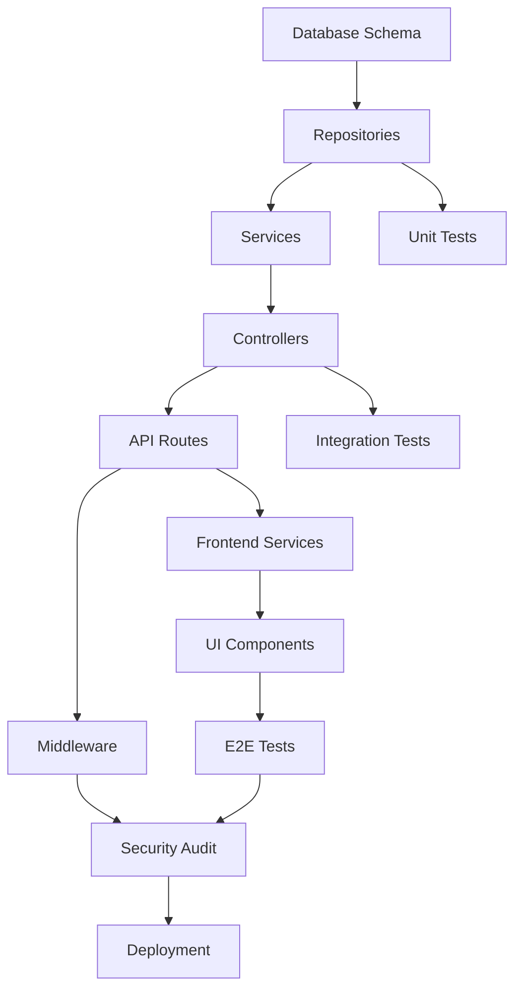

# VIP Employee Tracking - Part 8: Implementation Checklist & Timeline

**Part of:** [VIP Employee Tracking Implementation Plan](./VIP_EMPLOYEE_TRACKING_IMPLEMENTATION_PLAN.md)  
**Version:** 1.0  
**Last Updated:** November 21, 2025

---

## Table of Contents

1. [Implementation Timeline](#implementation-timeline)
2. [Phase 1 Checklist](#phase-1-checklist)
3. [Phase 2 Checklist](#phase-2-checklist)
4. [Phase 3 Checklist](#phase-3-checklist)
5. [Phase 4 Checklist](#phase-4-checklist)
6. [Testing Checklist](#testing-checklist)
7. [Deployment Checklist](#deployment-checklist)
8. [Post-Launch Checklist](#post-launch-checklist)

---

## Implementation Timeline

### Overview

```
Timeline: 4 Weeks (20 Working Days)

Week 1: Database & Backend Core (Phase 1)
├── Days 1-2: Database schema
├── Days 3-4: Repositories & Services
└── Day 5: API endpoints & Unit tests

Week 2: Access Logging & Security (Phase 2)
├── Days 6-7: Access logging system
├── Days 8-9: Middleware & Security
└── Day 10: Integration tests

Week 3: Frontend Implementation (Phase 3)
├── Days 11-12: UI components
├── Days 13-14: Feature integration
└── Day 15: E2E tests

Week 4: Polish & Deployment (Phase 4)
├── Days 16-17: Documentation & Refinement
├── Day 18: Security audit
├── Day 19: UAT & Bug fixes
└── Day 20: Production deployment
```

### Dependencies



---

## Phase 1 Checklist: Backend Foundation

### Day 1-2: Database Schema

- [ ] **Migration File Created**
  - [ ] `backend/src/database/migrations/20251121000000_add_vip_employee_tracking.sql`
  - [ ] Migration tested locally
  - [ ] Rollback script verified

- [ ] **VIP Status Table**
  - [ ] `nexus.vip_status` table created
  - [ ] All columns defined with correct types
  - [ ] Foreign keys to employees table
  - [ ] Indexes on `employee_id`, `organization_id`, `is_active`
  - [ ] Check constraints for VIP levels and security levels
  - [ ] Audit columns (created_at, updated_at, created_by, etc.)
  - [ ] Soft delete support (deleted_at)

- [ ] **Access Logs Table**
  - [ ] `nexus.vip_access_logs` table created
  - [ ] All columns defined
  - [ ] Foreign keys to employees and users
  - [ ] Indexes on `employee_id`, `timestamp`, `accessed_by`
  - [ ] Partitioning setup (optional, for high volume)

- [ ] **Views & Functions**
  - [ ] `nexus.v_active_vip_employees` view created
  - [ ] `nexus.fn_get_vip_access_summary()` function created
  - [ ] Performance verified with EXPLAIN ANALYZE

- [ ] **Seed Data**
  - [ ] Test VIP employees added to seed file
  - [ ] Sample access logs added
  - [ ] Seed script tested

### Day 3-4: Repositories & Services

- [ ] **VipStatusRepository**
  - [ ] File: `backend/src/products/nexus/repositories/VipStatusRepository.js`
  - [ ] Extends BaseRepository
  - [ ] All CRUD methods implemented
  - [ ] Custom query methods (findByEmployeeId, findActiveVips, etc.)
  - [ ] Uses custom query wrapper
  - [ ] Tenant isolation enforced

- [ ] **AccessLogRepository**
  - [ ] File: `backend/src/products/nexus/repositories/AccessLogRepository.js`
  - [ ] All logging methods implemented
  - [ ] Query methods for filtering and analytics
  - [ ] Batch insert support for high volume

- [ ] **VipStatusService**
  - [ ] File: `backend/src/products/nexus/services/VipStatusService.js`
  - [ ] Constructor with dependency injection
  - [ ] Static Joi validation schemas
  - [ ] `assignVipStatus()` method
  - [ ] `updateVipStatus()` method
  - [ ] `deactivateVipStatus()` method
  - [ ] `getVipStatusByEmployee()` method
  - [ ] `listActiveVips()` method
  - [ ] Business logic for expiration checks
  - [ ] Proper error handling

- [ ] **AccessLogService**
  - [ ] File: `backend/src/products/nexus/services/AccessLogService.js`
  - [ ] `logAccess()` method
  - [ ] `getAccessHistory()` method
  - [ ] `getSuspiciousActivity()` method
  - [ ] Analytics methods
  - [ ] Async logging support

- [ ] **DTOs**
  - [ ] File: `backend/src/products/nexus/dto/vipStatusDto.js`
  - [ ] `mapVipStatusDbToApi()` function
  - [ ] `mapVipStatusesDbToApi()` function
  - [ ] `mapVipStatusApiToDb()` function
  - [ ] File: `backend/src/products/nexus/dto/accessLogDto.js`
  - [ ] DTO functions for access logs

### Day 5: Controllers & Routes

- [ ] **VipStatusController**
  - [ ] File: `backend/src/products/nexus/controllers/vipStatusController.js`
  - [ ] `assignVipStatus` handler
  - [ ] `getVipStatus` handler
  - [ ] `getVipStatusByEmployee` handler
  - [ ] `updateVipStatus` handler
  - [ ] `deactivateVipStatus` handler
  - [ ] `listActiveVips` handler
  - [ ] Proper error handling with try/catch
  - [ ] Resource-specific response keys

- [ ] **AccessLogController**
  - [ ] File: `backend/src/products/nexus/controllers/accessLogController.js`
  - [ ] `getAccessHistory` handler
  - [ ] `getSuspiciousActivity` handler
  - [ ] `getAccessStatistics` handler

- [ ] **Routes**
  - [ ] File: `backend/src/products/nexus/routes/vipStatus.js`
  - [ ] All routes defined with correct HTTP methods
  - [ ] Authentication middleware applied
  - [ ] Authorization middleware (role checks)
  - [ ] Input validation middleware
  - [ ] File: `backend/src/products/nexus/routes/accessLogs.js`
  - [ ] Access log routes defined
  - [ ] Routes registered in Nexus product router

- [ ] **Unit Tests**
  - [ ] `tests/unit/products/nexus/services/VipStatusService.test.js`
  - [ ] All service methods tested
  - [ ] Validation tests
  - [ ] Error handling tests
  - [ ] 90%+ coverage achieved
  - [ ] `tests/unit/products/nexus/services/AccessLogService.test.js`
  - [ ] All tests passing

---

## Phase 2 Checklist: Access Logging & Security

### Day 6-7: Access Logging System

- [ ] **Logging Middleware**
  - [ ] File: `backend/src/products/nexus/middleware/vipAccessLogger.js`
  - [ ] Intercepts all VIP employee operations
  - [ ] Logs views, edits, exports, deletions
  - [ ] Captures IP address, user agent
  - [ ] Async logging (non-blocking)
  - [ ] Error handling for logging failures

- [ ] **Event Emitter Integration**
  - [ ] `vipAccessEventEmitter` created
  - [ ] Events: `vip:view`, `vip:edit`, `vip:export`, `vip:delete`
  - [ ] Listeners registered
  - [ ] Event data structure defined

- [ ] **Suspicious Activity Detection**
  - [ ] Algorithm for detecting suspicious patterns
  - [ ] Threshold configuration (failed attempts, time windows)
  - [ ] Alert system integration
  - [ ] Background job for analysis (optional)

### Day 8-9: Security Implementation

- [ ] **Authorization Middleware**
  - [ ] File: `backend/src/products/nexus/middleware/vipAuthorization.js`
  - [ ] Role-based access checks
  - [ ] VIP level permission checks
  - [ ] Special permissions for C-level, Board members
  - [ ] Proper 403 responses

- [ ] **Input Validation**
  - [ ] Joi schemas for all VIP endpoints
  - [ ] VIP level enum validation
  - [ ] Security level validation
  - [ ] Date range validation
  - [ ] UUID validation

- [ ] **Data Protection**
  - [ ] Sensitive fields redacted in logs
  - [ ] PII handling compliance
  - [ ] Encryption for sensitive notes (optional)

- [ ] **Rate Limiting**
  - [ ] Rate limits for VIP endpoints
  - [ ] Stricter limits for sensitive operations
  - [ ] Configuration in environment

### Day 10: Integration Tests

- [ ] **VIP Status API Tests**
  - [ ] File: `tests/integration/products/nexus/vip-status-api.test.js`
  - [ ] POST /vip-status tests
  - [ ] GET /vip-status/:id tests
  - [ ] GET /vip-status/employee/:employeeId tests
  - [ ] PATCH /vip-status/:id tests
  - [ ] DELETE /vip-status/:id tests
  - [ ] Authorization tests
  - [ ] Tenant isolation tests
  - [ ] All tests passing

- [ ] **Access Logging API Tests**
  - [ ] File: `tests/integration/products/nexus/access-logging-api.test.js`
  - [ ] GET /access-logs/employee/:id tests
  - [ ] Filtering tests
  - [ ] Pagination tests
  - [ ] All tests passing

- [ ] **Security Tests**
  - [ ] File: `tests/security/vip-access-control.test.js`
  - [ ] Role-based access tests
  - [ ] Cross-organization prevention tests
  - [ ] Permission boundary tests

---

## Phase 3 Checklist: Frontend Implementation

### Day 11-12: UI Components

- [ ] **VipBadge Component**
  - [ ] File: `apps/nexus/src/components/employees/VipBadge.tsx`
  - [ ] Component implemented
  - [ ] Props interface defined
  - [ ] Styling with TailwindCSS
  - [ ] Accessibility attributes
  - [ ] Hover tooltip
  - [ ] Icons for different VIP levels

- [ ] **VipStatusModal Component**
  - [ ] File: `apps/nexus/src/components/employees/VipStatusModal.tsx`
  - [ ] Form for assigning/editing VIP status
  - [ ] Field validation
  - [ ] Date pickers
  - [ ] Submit/Cancel actions
  - [ ] Loading states
  - [ ] Error handling

- [ ] **AccessLogViewer Component**
  - [ ] File: `apps/nexus/src/components/employees/AccessLogViewer.tsx`
  - [ ] Table with access logs
  - [ ] Filtering UI
  - [ ] Pagination
  - [ ] Date range picker
  - [ ] Export button
  - [ ] Responsive design

- [ ] **VipEmployeeCard Component**
  - [ ] File: `apps/nexus/src/components/employees/VipEmployeeCard.tsx`
  - [ ] Enhanced employee card
  - [ ] VIP badge display
  - [ ] Security level indicator
  - [ ] Quick actions menu

### Day 13-14: Feature Integration

- [ ] **API Client Integration**
  - [ ] `NexusClient` methods for VIP endpoints
  - [ ] Method: `assignVipStatus()`
  - [ ] Method: `getVipStatus()`
  - [ ] Method: `updateVipStatus()`
  - [ ] Method: `deactivateVipStatus()`
  - [ ] Method: `getAccessLogs()`
  - [ ] Error handling

- [ ] **React Query Hooks**
  - [ ] File: `apps/nexus/src/hooks/useVipStatus.ts`
  - [ ] `useVipStatus(employeeId)` hook
  - [ ] `useAssignVipStatus()` mutation
  - [ ] `useUpdateVipStatus()` mutation
  - [ ] `useDeactivateVipStatus()` mutation
  - [ ] File: `apps/nexus/src/hooks/useAccessLogs.ts`
  - [ ] `useAccessLogs(employeeId)` hook
  - [ ] Query invalidation on mutations

- [ ] **Page Integration**
  - [ ] Employee List page updated
  - [ ] VIP badge shown in list
  - [ ] Filter for VIP employees
  - [ ] Employee Detail page updated
  - [ ] VIP status section added
  - [ ] Access log viewer added
  - [ ] Admin VIP Management page created
  - [ ] Dashboard widget for VIP employees

- [ ] **Navigation & Routes**
  - [ ] Route: `/employees/:id` (with VIP section)
  - [ ] Route: `/admin/vip-employees`
  - [ ] Navigation menu updated
  - [ ] Permissions-based menu visibility

### Day 15: E2E Tests

- [ ] **E2E Test Suite**
  - [ ] File: `tests/e2e/vip-employee-management.test.js`
  - [ ] Test: Complete VIP assignment flow
  - [ ] Test: Access logging verification
  - [ ] Test: VIP status update
  - [ ] Test: VIP deactivation
  - [ ] Test: Access log filtering
  - [ ] Server lifecycle management
  - [ ] All tests passing

---

## Phase 4 Checklist: Deployment & Launch

### Day 16-17: Documentation & Refinement

- [ ] **API Documentation**
  - [ ] OpenAPI/Swagger docs updated
  - [ ] All VIP endpoints documented
  - [ ] Request/response examples
  - [ ] Error codes documented

- [ ] **User Documentation**
  - [ ] User manual section created
  - [ ] How to assign VIP status
  - [ ] How to view access logs
  - [ ] Permissions guide
  - [ ] Screenshots added

- [ ] **Developer Documentation**
  - [ ] Implementation plan finalized
  - [ ] Architecture diagrams updated
  - [ ] Code comments reviewed
  - [ ] README updates

- [ ] **Code Refinement**
  - [ ] Code review completed
  - [ ] Linting issues fixed
  - [ ] TypeScript errors resolved
  - [ ] Performance optimizations applied

### Day 18: Security Audit

- [ ] **Security Checklist**
  - [ ] SQL injection prevention verified
  - [ ] XSS prevention verified
  - [ ] CSRF protection enabled
  - [ ] Rate limiting tested
  - [ ] Authentication verified
  - [ ] Authorization verified
  - [ ] Tenant isolation verified
  - [ ] Input validation comprehensive
  - [ ] Sensitive data handling reviewed
  - [ ] Logging security events
  - [ ] No secrets in code
  - [ ] Environment variables secured

- [ ] **Penetration Testing**
  - [ ] Attempt unauthorized VIP assignment
  - [ ] Attempt cross-organization access
  - [ ] Attempt SQL injection
  - [ ] Attempt privilege escalation
  - [ ] All attacks properly blocked

### Day 19: UAT & Bug Fixes

- [ ] **User Acceptance Testing**
  - [ ] Test with product owner
  - [ ] Test with HR admin
  - [ ] Test with security officer
  - [ ] Feedback collected
  - [ ] Critical bugs fixed
  - [ ] Nice-to-have features noted

- [ ] **Bug Fixes**
  - [ ] All critical bugs resolved
  - [ ] All high-priority bugs resolved
  - [ ] Medium bugs triaged
  - [ ] Regression testing completed

- [ ] **Performance Validation**
  - [ ] Load testing passed
  - [ ] Response times acceptable
  - [ ] Database queries optimized
  - [ ] No N+1 query issues

### Day 20: Production Deployment

- [ ] **Pre-Deployment**
  - [ ] Database backup created
  - [ ] Migration script tested on staging
  - [ ] Rollback plan documented
  - [ ] Deployment window scheduled
  - [ ] Stakeholders notified

- [ ] **Deployment**
  - [ ] Database migration executed
  - [ ] Backend deployed
  - [ ] Frontend deployed
  - [ ] Smoke tests passed
  - [ ] Health checks passing

- [ ] **Post-Deployment**
  - [ ] Production verification
  - [ ] Monitoring alerts configured
  - [ ] Error tracking enabled
  - [ ] Performance baselines recorded
  - [ ] User notifications sent

---

## Testing Checklist

### Unit Tests

- [ ] **Services**
  - [ ] VipStatusService: 90%+ coverage
  - [ ] AccessLogService: 90%+ coverage
  - [ ] All business logic tested
  - [ ] Edge cases covered
  - [ ] Error handling tested

- [ ] **Repositories**
  - [ ] VipStatusRepository: 85%+ coverage
  - [ ] AccessLogRepository: 85%+ coverage
  - [ ] CRUD operations tested
  - [ ] Custom queries tested
  - [ ] Tenant isolation tested

- [ ] **Controllers**
  - [ ] VipStatusController: 75%+ coverage
  - [ ] AccessLogController: 75%+ coverage
  - [ ] Request/response handling tested
  - [ ] Error scenarios tested

### Integration Tests

- [ ] **API Endpoints**
  - [ ] All VIP status endpoints tested
  - [ ] All access log endpoints tested
  - [ ] Authentication tested
  - [ ] Authorization tested
  - [ ] Tenant isolation tested
  - [ ] Response format verified

- [ ] **Database**
  - [ ] Schema constraints tested
  - [ ] Foreign keys enforced
  - [ ] Indexes working
  - [ ] Queries performant

### E2E Tests

- [ ] **User Journeys**
  - [ ] Assign VIP status flow
  - [ ] Update VIP status flow
  - [ ] Deactivate VIP status flow
  - [ ] View access logs flow
  - [ ] Filter access logs flow

- [ ] **Cross-Feature**
  - [ ] VIP employee in list
  - [ ] VIP employee in detail
  - [ ] Access logging triggered
  - [ ] Notifications working (if applicable)

### Security Tests

- [ ] **Access Control**
  - [ ] Role-based access verified
  - [ ] Unauthorized access blocked
  - [ ] Cross-organization blocked

- [ ] **Data Protection**
  - [ ] Sensitive data encrypted
  - [ ] PII handling compliant
  - [ ] Logs sanitized

---

## Deployment Checklist

### Pre-Deployment

- [ ] **Environment Setup**
  - [ ] Staging environment ready
  - [ ] Production environment ready
  - [ ] Database credentials configured
  - [ ] Environment variables set

- [ ] **Code Preparation**
  - [ ] All code merged to main
  - [ ] Version tagged
  - [ ] Changelog updated
  - [ ] Build successful

- [ ] **Database Preparation**
  - [ ] Migration script reviewed
  - [ ] Backup strategy confirmed
  - [ ] Rollback script tested
  - [ ] Downtime window scheduled

### Deployment Steps

1. **Database Migration**
   ```bash
   # Backup database
   pg_dump recruitiq_prod > backup_pre_vip_feature.sql
   
   # Run migration
   psql recruitiq_prod < migrations/20251121000000_add_vip_employee_tracking.sql
   
   # Verify migration
   psql recruitiq_prod -c "\d nexus.vip_status"
   ```

2. **Backend Deployment**
   ```bash
   # Build backend
   cd backend
   npm run build
   
   # Deploy to server
   npm run deploy:production
   
   # Restart server
   pm2 restart recruitiq-backend
   ```

3. **Frontend Deployment**
   ```bash
   # Build frontend
   cd apps/nexus
   npm run build
   
   # Deploy to CDN/server
   npm run deploy:production
   ```

4. **Verification**
   ```bash
   # Health check
   curl https://api.recruitiq.com/health
   
   # Test VIP endpoint
   curl https://api.recruitiq.com/api/products/nexus/vip-status \
     -H "Authorization: Bearer $TOKEN"
   ```

### Post-Deployment

- [ ] **Smoke Tests**
  - [ ] Health endpoint responding
  - [ ] VIP endpoints accessible
  - [ ] Database queries working
  - [ ] Frontend loading correctly

- [ ] **Monitoring**
  - [ ] Application logs reviewed
  - [ ] Error tracking checked
  - [ ] Performance metrics baseline
  - [ ] Alerts configured

- [ ] **Communication**
  - [ ] Deployment announcement sent
  - [ ] User guide shared
  - [ ] Support team briefed
  - [ ] Stakeholders notified

---

## Post-Launch Checklist

### Week 1 Post-Launch

- [ ] **Monitoring**
  - [ ] Daily error log review
  - [ ] Performance metrics monitored
  - [ ] User feedback collected
  - [ ] Support tickets tracked

- [ ] **Bug Fixes**
  - [ ] Critical bugs addressed within 24h
  - [ ] High-priority bugs scheduled
  - [ ] Hotfix deployed if needed

- [ ] **User Support**
  - [ ] Training sessions conducted
  - [ ] FAQ document created
  - [ ] Support documentation updated

### Month 1 Post-Launch

- [ ] **Analytics Review**
  - [ ] Feature adoption metrics
  - [ ] Performance metrics
  - [ ] User satisfaction survey
  - [ ] Database growth monitored

- [ ] **Optimization**
  - [ ] Performance bottlenecks identified
  - [ ] Database indexes optimized
  - [ ] UI/UX improvements planned
  - [ ] Feature enhancements prioritized

- [ ] **Documentation Updates**
  - [ ] User manual refined
  - [ ] API docs updated
  - [ ] Known issues documented
  - [ ] Best practices published

---

## Success Criteria

### Technical Success

- [ ] All tests passing (unit, integration, E2E)
- [ ] Code coverage > 80%
- [ ] API response times < 200ms (p95)
- [ ] Zero critical security vulnerabilities
- [ ] Zero data breaches or unauthorized access
- [ ] 99.9% uptime in first month

### Business Success

- [ ] 100% of VIP employees identified and tagged
- [ ] Access logging enabled for all VIP operations
- [ ] Security audit passed
- [ ] Compliance requirements met
- [ ] User satisfaction > 4/5
- [ ] < 5 support tickets per week

### User Success

- [ ] HR admins can assign VIP status easily
- [ ] Security officers can view access logs
- [ ] Executives receive appropriate protections
- [ ] No impact on regular employee operations
- [ ] Training completed within 2 weeks

---

## Rollback Plan

### If Critical Issues Occur

1. **Immediate Response**
   - Assess severity
   - Notify stakeholders
   - Activate incident response

2. **Database Rollback**
   ```bash
   # Restore database backup
   psql recruitiq_prod < backup_pre_vip_feature.sql
   
   # Verify restoration
   psql recruitiq_prod -c "SELECT COUNT(*) FROM nexus.employees"
   ```

3. **Code Rollback**
   ```bash
   # Revert to previous version
   git revert HEAD~1
   
   # Redeploy
   npm run deploy:production
   ```

4. **Communication**
   - Notify users of rollback
   - Provide timeline for fix
   - Document lessons learned

---

## Contact & Escalation

### Key Contacts

- **Technical Lead:** [Name] - [Email]
- **Product Owner:** [Name] - [Email]
- **Security Officer:** [Name] - [Email]
- **DevOps Lead:** [Name] - [Email]

### Escalation Path

1. Developer → Technical Lead (0-4 hours)
2. Technical Lead → Product Owner (4-8 hours)
3. Product Owner → CTO (8+ hours)

---

## Appendix: Quick Reference

### Key Files

```
Backend:
- backend/src/products/nexus/services/VipStatusService.js
- backend/src/products/nexus/repositories/VipStatusRepository.js
- backend/src/products/nexus/controllers/vipStatusController.js
- backend/src/products/nexus/routes/vipStatus.js

Frontend:
- apps/nexus/src/components/employees/VipBadge.tsx
- apps/nexus/src/components/employees/VipStatusModal.tsx
- apps/nexus/src/hooks/useVipStatus.ts

Database:
- backend/src/database/migrations/20251121000000_add_vip_employee_tracking.sql

Tests:
- tests/unit/products/nexus/services/VipStatusService.test.js
- tests/integration/products/nexus/vip-status-api.test.js
- tests/e2e/vip-employee-management.test.js
```

### Key Commands

```bash
# Run all tests
npm test

# Run VIP feature tests only
npm test -- --testPathPattern=vip

# Run with coverage
npm test -- --coverage

# Run E2E tests
npm run test:e2e

# Database migration
psql recruitiq_dev < migrations/20251121000000_add_vip_employee_tracking.sql

# Start dev environment
pnpm dev
```

---

**Implementation Complete!** ✅

This comprehensive implementation plan provides everything needed to successfully implement VIP Employee Tracking in the RecruitIQ Nexus HRIS system.
